| name | cuda | hip | hipified | omp_nvc | omp_aomp | plot |
| -- | -- | -- | -- | -- | -- | -- |
| accuracy | 5.55 | 6.49 | 6.48 | 63.77 | 10.19 | |
| ace | 9.52 | 3.35 | 3.32 | 5.15 | exe err | |
| adam | 7.08 | 4.20 | 4.19 | 8.65 | exe err | |
| addBiasResidualLayerNorm | 18.92 | 50.36 | exe err | -- | -- | |
| adv | 7.32 | 12.87 | 13.06 | 7.81 | 4.22 | |
| aes | 8.95 | 1.23 | 1.21 | 8.99 | 0.74 | |
| affine | 7.76 | 4.91 | 4.72 | 14.42 | 32.31 | |
| aidw | 11.02 | 9.75 | 48.61 | 11.46 | 87.89 | |
| aligned-types | 5.70 | 2.16 | 2.16 | 6.91 | 3.42 | |
| all-pairs-distance | 6.19 | 22.04 | 21.94 | 20.97 | 3.41 | |
| allreduce | 67.40 | 44.81 | 44.71 | -- | -- | |
| amgmk | 4.53 | 0.75 | 0.74 | 4.52 | 0.80 | |
| ans | 6.89 | 3.15 | 3.29 | exe err | 3.53 | |
| aobench | 4.48 | 0.48 | 0.48 | 7.60 | 1.53 | |
| aop | 8.77 | 34.60 | 39.66 | 306.19 | exe err | |
| asmooth | 16.35 | 12.53 | 13.39 | 9.84 | 17.43 | |
| assert | 4.36 | exe err | exe err | -- | -- | |
| asta | 6.24 | 3.67 | 3.69 | 12.83 | exe err | |
| atan2 | 4.68 | 0.75 | 0.76 | 4.59 | 0.77 | |
| atomicAggregate | 7.63 | 5.51 | build err | -- | -- | |
| atomicCAS | 17.72 | 14.55 | 15.02 | -- | -- | |
| atomicCost | 97.45 | 7.86 | 7.93 | 96.88 | 25.15 | |
| atomicIntrinsics | 89.73 | 70.29 | 70.31 | 4.58 | 0.90 | |
| atomicPerf | 11.11 | 5.23 | 9153.82 | 12.14 | 367.77 | |
| atomicReduction | 5.09 | 0.92 | 0.92 | 4.94 | 1.79 | |
| atomicSystemWide | 5.31 | 10.19 | 11.58 | -- | -- | |
| attention | 4.93 | 19.14 | 19.41 | 86.14 | 30.19 | |
| attentionMultiHead | 5.36 | 1.66 | build err | -- | -- | |
| axhelm | 4.45 | 0.79 | 0.79 | 4.52 | 0.81 | |
| b+tree | 4.63 | 0.92 | 0.92 | 4.56 | 0.87 | |
| babelstream | 4.64 | 0.95 | 0.95 | 4.65 | 3.11 |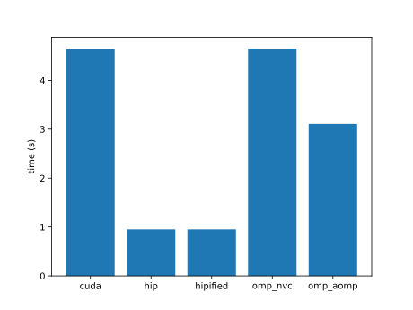 |
| background-subtract | 5.31 | 4.41 | 4.72 | 7.17 | 4.49 | |
| backprop | 4.51 | 0.46 | 0.46 | 4.94 | 0.25 | |
| bezier-surface | 18.36 | 23.78 | 23.78 | 17.16 | 23.87 | |
| bfs | 5.01 | 1.15 | 1.10 | 4.84 | 1.07 | |
| bh | 8.16 | 6715.84 | 9574.28 | -- | -- | |
| bicgstab | 1.02 | build err | over 120 | -- | -- | |
| bilateral | 9.52 | 46.55 | 18.20 | 10.11 | 548.56 | |
| bincount | 5.48 | 2.01 | 2.01 | -- | -- | |
| binomial | 4.92 | 1.78 | 1.78 | -- | 1.65 | |
| bitcracker | 17.68 | 24.08 | 24.11 | -- | -- | |
| bitonic-sort | 16.45 | 13.34 | 13.31 | 11.35 | 14.64 | |
| bitpacking | 8.14 | 4.10 | 4.09 | -- | -- | |
| bitpermute | 6.01 | 7.06 | build err | -- | -- | |
| black-scholes | 9.55 | 3.97 | 3.95 | 7.78 | 8.32 | |
| blas-dot | 8.90 | 10.00 | 10.01 | -- | -- | |
| blas-fp8gemm | 4.10 | 5.63 | build err | -- | -- | |
| blas-gemm | 12.53 | 4.48 | 4.48 | -- | -- | |
| blas-gemmBatched | 19.85 | 21.57 | 21.59 | -- | -- | |
| blas-gemmEx | 15.44 | over 300 | build err | -- | -- | |
| blas-gemmEx2 | 15.35 | over 300 | build err | -- | -- | |
| blas-gemmStridedBatched | 17.48 | 21.57 | build err | -- | -- | |
| blockAccess | 5.76 | 8.15 | 8.13 | -- | -- | |
| blockexchange | 33.67 | 0.67 | 0.67 | -- | -- | |
| bm3d | 5.32 | 6.80 | 6.71 | -- | -- | |
| bmf | exe err | 7.23 | build err | -- | -- | |
| bn | 6.33 | exe err | exe err | exe err | 33.49 | |
| bonds | 14.44 | 19.26 | 19.28 | 16.35 | 15.18 | |
| boxfilter | 8.75 | 9.16 | 9.16 | 11.78 | 37.13 | |
| bscan | 9.54 | 1.78 | 0.44 | -- | -- | |
| bsearch | 743.47 | 4.61 | 4.61 | exe err | 34.57 | |
| bspline-vgh | 14.11 | 10.08 | 10.08 | 9.98 | 11.30 | |
| bsw | 4.21 | 0.53 | build err | -- | -- | |
| btree | 5.43 | -- | build err | -- | -- | |
| burger | 110.83 | 21.37 | 21.44 | 75.83 | 25.65 | |
| bwt | 209.63 | 13.38 | 13.66 | exe err | 15.18 | |
| car | 11.59 | 19.95 | 19.95 | 11.59 | 49.90 | |
| cbsfil | 43.47 | 5.93 | 5.94 | 42.67 | 8.36 | |
| cc | 5.11 | 2.49 | build err | -- | -- | |
| ccl | 42.14 | build err | build err | -- | -- | |
| ccs | 5.36 | over 300 | over 300 | 5.36 | over 300 | |
| ccsd-trpdrv | 41.53 | 19.17 | 19.35 | 35.93 | 2.34 | |
| ced | 6.51 | 2.76 | 2.74 | -- | -- | |
| cfd | 4.67 | 1.46 | 1.48 | 4.93 | 2.65 | |
| chacha20 | 6.78 | 8.25 | 8.24 | 8.89 | 7.34 | |
| channelShuffle | 49.94 | 38.92 | 32.81 | 68.93 | 76.38 | |
| channelSum | 66.15 | 52.23 | 52.13 | 69.99 | 295.96 | |
| che | 5.18 | 2.69 | 2.69 | 5.25 | 14.97 |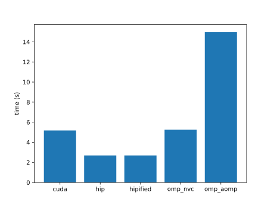 |
| chemv | 5.08 | 1.90 | 1.90 | 5.54 | build err | |
| chi2 | 223.36 | 20.42 | 20.40 | 260.91 | 184.59 | |
| clenergy | 4.83 | 1.34 | 1.34 | 5.26 | 17.58 | |
| clink | 5.71 | 5.67 | 5.12 | 7.66 | 6.56 | |
| clock | 4.48 | 0.44 | 0.42 | -- | -- | |
| cm | 1352.85 | 4307.41 | 4303.46 | build err | build err | |
| cmembench | 6.34 | 10.19 | 10.18 | -- | -- | |
| cmp | 8.14 | 12.45 | 12.46 | 9.27 | 14.24 | |
| cobahh | 480.09 | 684.64 | 672.18 | 417.25 | 657.95 | |
| collision | 9.90 | 2.58 | build err | -- | -- | |
| colorwheel | 48.47 | 2.35 | 2.35 | 42.53 | 3.46 | |
| columnarSolver | 11.32 | exe err | exe err | 11.60 | exe err | |
| complex | 25.25 | 3.68 | 3.67 | 15.22 | 26.06 | |
| compute-score | 6.84 | 4.74 | 4.74 | 8.43 | 1.92 |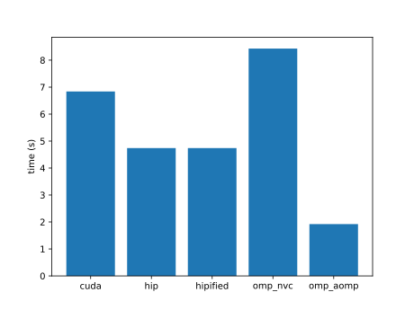 |
| concat | 26.60 | 13.27 | 13.17 | 26.21 | 57.74 | |
| concurrentKernels | 283.38 | 31.63 | 31.63 | -- | -- | |
| contract | 1497.61 | 15.19 | 15.24 | 1418.37 | 24.22 | |
| conversion | 6.77 | 0.91 | 0.91 | 5.45 | 1.49 | |
| convolution1D | 1715.16 | 100.98 | 100.98 | 3870.95 | 193.78 | |
| convolution3D | 2.86 | 75.10 | build err | 4.63 | 190.53 | |
| convolutionDeformable | build err | 10.12 | 10.32 | -- | -- | |
| convolutionSeparable | 19.86 | 26.99 | 25.70 | 30.44 | 25.65 | |
| cooling | 2269.87 | 1.05 | 1.85 | 1115.12 | 8.40 | |
| coordinates | 510.74 | 3.35 | 3.34 | -- | -- | |
| copy | 30.88 | 15.66 | 2659.07 | -- | -- | |
| crc64 | 159.62 | 4.06 | 4.05 | 168.38 | 4.52 | |
| cross | 10.92 | 11.47 | 11.47 | 681.38 | 10.64 | |
| crossEntropy | 11.71 | 10.41 | 10.40 | -- | -- | |
| crs | 1259.70 | 10.30 | 10.30 | | 11.64 | |
| d2q9-bgk | 4.59 | 1.46 | 1.47 | 6.04 | 5.30 | |
| d3q19-bgk | 8.73 | 24.91 | 24.99 | -- | -- | |
| damage | 25.55 | 1.02 | 1.02 | 222.52 | 0.79 | |
| daphne | 2.50 | 0.78 | 0.79 | -- | -- | |
| dct8x8 | 181.81 | 1.50 | 1.50 | exe err | 1.25 | |
| ddbp | 18.57 | 4.88 | 4.88 | 18.44 | 9.96 | |
| debayer | 15.96 | 0.93 | 1.08 | exe err | 1.39 | |
| degrid | 17.95 | 48.95 | 51.49 | 22.38 | 113.63 | |
| dense-embedding | 198.45 | 180.11 | 180.26 | 1777.93 | 721.85 | |
| depixel | 1163.31 | 30.85 | 30.91 | 6489.09 | 12.29 | |
| deredundancy | 18.25 | 59.04 | 59.03 | 18.18 | 43.62 | |
| determinant | 4.73 | 0.67 | 0.67 | -- | -- | |
| diamond | 40.77 | 45.36 | 46.11 | 40.97 | build err | |
| dispatch | 6.37 | 1.98 | 2.02 | -- | -- | |
| distort | 4.51 | 0.52 | 0.51 | 4.57 | 1.52 | |
| divergence | 6.50 | 1.64 | 1.64 | 5.03 | 4.81 | |
| doh | 18.82 | 19.78 | 19.77 | 6.18 | 19.63 | |
| dp | 54.96 | 15.64 | 15.62 | 34.07 | 31.72 | |
| dpid | 50.59 | 1.01 | build err | -- | -- | |
| dropout | 31.01 | 0.93 | 0.93 | -- | -- | |
| dslash | 6.75 | 2.19 | 4.42 | 15.43 | 4.68 | |
| dwconv | 81.64 | 23.33 | 23.22 | -- | -- | |
| dwconv1d | 6.80 | 19.33 | 19.45 | -- | -- | |
| dxtc1 | 4.19 | 0.61 | 0.63 | -- | -- | |
| dxtc2 | 4.23 | 0.46 | 0.46 | 4.37 | 0.41 | |
| easyWave | 7.11 | 2.48 | 2.46 | 7.25 | 3.17 | |
| ecdh | 37.30 | 2.97 | 2.98 | 40.94 | 43.45 | |
| egs | 4.96 | exe err | build err | -- | -- | |
| eigenvalue | 23.90 | 13.44 | 13.40 | 22.87 | 16.98 | |
| eikonal | 206.17 | 10.50 | 9.93 | -- | -- | |
| entropy | 57.12 | 10.30 | 10.29 | 57.16 | 19.05 | |
| epistasis | 67.92 | 189.79 | 189.71 | 136.80 | 710.62 |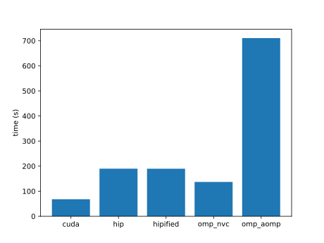 |
| ert | 7.38 | 3.53 | 3.53 | -- | -- | |
| expdist | 9.41 | 7.21 | 7.21 | 15.58 | 5.28 | |
| extend2 | 7.56 | 11.37 | 11.34 | 6.81 | 0.79 | |
| extrema | 8.83 | 6.38 | 6.40 | 9.40 | 20.70 | |
| f16max | 25.83 | 35.51 | 35.49 | -- | -- | |
| f16sp | 33.71 | 30.80 | 1868.33 | -- | -- | |
| face | 4.68 | 1.05 | 1.05 | build err | exe err | |
| fdtd3d | 35.55 | 4.92 | 4.67 | 49.94 | 4.43 | |
| feynman-kac | 84.36 | 114.00 | 115.15 | 24.12 | 46.84 | |
| fft | 6.52 | 2.18 | 2.18 | 7.49 | 0.49 | |
| fhd | 765.79 | 1.11 | 1.09 | | 32.30 | |
| filter | 174.29 | 15.03 | 15.04 | 174.81 | 7.50 | |
| flame | 5.83 | 3.90 | 3.93 | -- | -- | |
| flip | 85.49 | 10.28 | 10.30 | 90.87 | 43.39 | |
| floydwarshall | 78.88 | 1.92 | 1.95 | 97.80 | 5.67 | |
| floydwarshall2 | 10.25 | 6.18 | 6.38 | -- | -- | |
| fluidSim | 22.99 | 25.92 | 25.54 | 21.98 | 30.36 | |
| fpc | 70.35 | 1.40 | 1.40 | exe err | 0.80 | |
| fpdc | 6.45 | 2.98 | 2.96 | build err | exe err | |
| frechet | 15.26 | 1.11 | 1.11 | exe err | 1.04 | |
| fresnel | 8.66 | 6.65 | build err | build err | 13.98 | |
| frna | build err | 346.24 | 347.30 | exe err | over 360 | |
| fsm | 5.16 | 6.99 | 7.00 | build err | 0.34 | |
| fwt | 5.36 | 1.60 | 1.59 | 5.83 | 3.69 | |
| ga | 52.84 | 5.01 | 5.02 | 36.55 | 5.93 | |
| gabor | 120.39 | 4.92 | 7.98 | exe err | 51.57 | |
| gamma-correction | 2178.54 | 19.22 | 19.21 | 3350.52 | 16.87 | |
| gaussian | 20.74 | 5.63 | 5.66 | 9.21 | 9.71 | |
| gc | 4.24 | exe err | build err | build err | exe err | |
| gd | 12.87 | 12.91 | 28.89 | 13.65 | 28.57 | |
| ge-spmm | 7.26 | 8.56 | 8.55 | -- | -- | |
| geam | 127.40 | 20.72 | 20.72 | -- | -- | |
| gels | 4.67 | 1.83 | build err | -- | -- | |
| gelu | 57.17 | 58.40 | 57.65 | -- | -- | |
| gemv | 9.81 | 78.18 | build err | -- | -- | |
| geodesic | 6.55 | 3.83 | 3.82 | 6.42 | 4.02 | |
| gerbil | exe err | 3.06 | build err | -- | -- | |
| gibbs | 4.53 | 0.71 | 0.70 | -- | -- | |
| glu | 156.41 | exe err | 118.35 | 1593.95 | 164.83 | |
| gmm | 299.98 | 1.92 | 1.03 | 341.15 | 3.68 | |
| goulash | 142.59 | 11.60 | 11.66 | 147.07 | 20.07 | |
| gpp | 6.83 | 238.43 | 234.16 | 6.99 | 29.99 | |
| graphB+ | 7.21 | over 3600 | build err | -- | -- | |
| graphExecution | 6.60 | 1.84 | 1.84 | -- | -- | |
| grep | 923.81 | 96.57 | 96.60 | 473.83 | 30.55 | |
| grrt | 17.00 | 55.86 | 52.29 | 15.40 | | |
| gru | 26.44 | 48.42 | 48.44 | -- | -- | |
| haccmk | 6.54 | 4.25 | 4.25 | 6.38 | 5.41 | |
| halo-finder | 5.44 | 4.50 | 7.77 | -- | -- | |
| hausdorff | 32.73 | 14.40 | 14.40 | 33.92 | 15.64 | |
| haversine | 6.46 | 1.82 | 2.05 | 6.52 | 2.09 | |
| hbc | 15.68 | 15.25 | 15.24 | -- | -- | |
| heartwall | 4.66 | 1.97 | 1.93 | exe err | exe err | |
| heat | 26.31 | 39.72 | 40.25 | 91.48 | 69.52 | |
| heat2d | build err | 11.03 | 11.50 | 248.52 | 329.62 |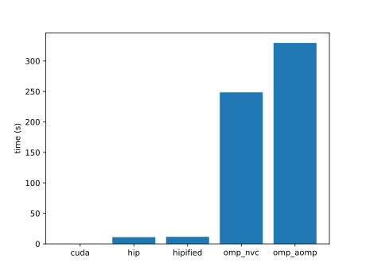 |
| hellinger | 7.13 | 6.61 | 6.62 | 6.87 | 6.52 | |
| henry | 5.87 | 2.89 | 4.51 | 5.07 | 3.89 | |
| hexciton | 6.06 | 7.37 | build err | 6.82 | 17.83 | |
| histogram | 10.43 | 1.30 | 1.33 | 5.30 | 8.38 | |
| hmm | 7.18 | 3.94 | 3.97 | 17.31 | 7.21 | |
| hogbom | 5.19 | 1.03 | 0.93 | 5.20 | 0.99 | |
| hotspot | 4.71 | 0.60 | 0.59 | -- | -- | |
| hotspot3D | 22.97 | 23.21 | 23.24 | 19.42 | 27.55 | |
| hpl | 115.39 | 112.16 | build err | -- | -- | |
| hungarian | 4.65 | 0.76 | 0.75 | -- | -- | |
| hwt1d | 6.12 | 3.39 | 3.38 | 6.37 | 3.49 | |
| hybridsort | 17.40 | 16.39 | 16.36 | 18.47 | 16.45 | |
| hypterm | 10.92 | 15.09 | 15.05 | 18.92 | 20.58 | |
| idivide | 7.92 | 6.23 | 6.23 | 11.15 | exe err | |
| interleave | 6.02 | 3.46 | 3.47 | 5.30 | 3.39 | |
| interval | 13.69 | 46.97 | 47.13 | 17.43 | 55.60 | |
| intrinsics-cast | 69.54 | 9.21 | 9.22 | -- | -- | |
| intrinsics-simd | 27.93 | -- | build err | -- | -- | |
| inversek2j | 4.57 | 0.60 | 0.60 | 11.78 | 24.34 | |
| is | 4.55 | 1.41 | 1.42 | -- | -- | |
| ising | 33.95 | 15.69 | 15.71 | 33.13 | 22.85 | |
| iso2dfd | 22.57 | 61.89 | 60.41 | 21.23 | 61.67 | |
| jaccard | 197.46 | 254.66 | build err | -- | -- | |
| jacobi | 4.81 | 8.91 | build err | 5.41 | 5.95 | |
| jenkins-hash | 9.50 | 5.10 | 5.11 | 9.52 | 5.57 | |
| kalman | 22.24 | 27.92 | 27.93 | exe err | 10.03 | |
| keccaktreehash | 11.89 | 10.72 | 10.73 | 12.56 | 10.70 | |
| keogh | 215.35 | 85.25 | 85.27 | 50.03 | 87.04 | |
| kernelLaunch | 16.18 | 19.08 | 19.23 | 75.33 | 104.50 | |
| kmc | 7.45 | 6.16 | 6.19 | -- | -- | |
| kmeans | 32.53 | 42.64 | 42.41 | 30.35 | 49.75 | |
| knn | 8.54 | 10.95 | 10.88 | 8.96 | 11.38 | |
| kurtosis | 22.01 | 167.60 | 167.91 | -- | -- | |
| lanczos | 6.90 | 3.34 | 3.26 | 7.31 | 3.91 | |
| langevin | 73.86 | 10.60 | 12.36 | 74.80 | 16.99 | |
| langford | 4.89 | 2.58 | 2.59 | build err | exe err | |
| laplace | 5.84 | 4.45 | 4.45 | 9.40 | 21.52 | |
| laplace3d | 95.07 | 18.61 | 17.75 | 56.92 | 22.79 | |
| lavaMD | 104.12 | 61.88 | 61.77 | 194.21 | 55.93 | |
| layernorm | 9.80 | 4.11 | build err | -- | -- | |
| layout | 5.09 | 1.39 | 1.39 | 4.86 | 1.63 | |
| lci | 19.97 | 8.41 | 8.41 | 4.37 | 7.82 | |
| lda | 5.36 | 2.07 | 2.07 | build err | 14.90 | |
| ldpc | 7.08 | 5.98 | 5.98 | 12.12 | 17.04 | |
| lebesgue | 8.34 | 35.07 | 18.50 | 6.62 | 36.22 | |
| leukocyte | 4.76 | 1.16 | 1.02 | 6.07 | 1.15 | |
| lfib4 | 188.11 | 31.34 | 28.44 | -- | -- | |
| libor | 4.75 | 1.28 | 1.28 | 5.20 | 1.74 | |
| lid-driven-cavity | 12.87 | 14.53 | 14.57 | 26.01 | 48.17 | |
| lif | 133.75 | 76.25 | 76.29 | 150.82 | 80.63 | |
| linearprobing | 106.78 | 76.77 | 76.54 | build err | exe err | |
| log2 | 6.85 | 1.27 | 1.28 | exe err | 1.78 | |
| logan | 10.75 | 15.29 | 15.64 | -- | -- | |
| logic-resim | 8.50 | 7.53 | 7.52 | -- | -- | |
| logic-rewrite | 52.42 | build err | build err | -- | -- | |
| logprob | 18.96 | 16.59 | build err | -- | -- | |
| lombscargle | 4.83 | 1.18 | 1.18 | 4.88 | 1.18 | |
| loopback | 7.82 | 10.90 | 10.88 | 10.54 | 11.34 | |
| lr | 8.53 | 6.75 | 6.73 | 33.47 | 48.47 | |
| lrn | 121.77 | 49.70 | 50.15 | 127.24 | 63.45 | |
| lsqt | 22.07 | 60.46 | build err | 36.89 | 74.43 | |
| lud | 20.77 | 10.18 | 10.19 | 62.18 | 21.33 | |
| ludb | 6.93 | 9.73 | build err | -- | -- | |
| lulesh | 13.37 | 15.84 | 13.93 | 14.09 | 566.69 | |
| lzss | 0.00 | | | -- | -- | |
| mallocFree | 5.60 | 9.40 | build err | 4.62 | 0.72 | |
| mandelbrot | 7.37 | 16.41 | 15.85 | 5.63 | 13.34 | |
| marchingCubes | 12.32 | 7.75 | build err | -- | -- | |
| mask | 168.00 | 90.46 | 90.48 | 242.76 | 93.65 | |
| match | 42.52 | 69.92 | 69.90 | 46.11 | 80.30 | |
| matern | 17.87 | 31.70 | 31.69 | 116.98 | 111.40 | |
| matrix-rotate | 30.57 | 9.78 | 10.18 | 31.16 | 10.20 | |
| matrixT | 59.14 | 22.03 | 22.05 | -- | -- | |
| maxFlops | 27.61 | 41.98 | 41.97 | 27.71 | 42.92 | |
| maxpool3d | 40.06 | 15.72 | 14.82 | 40.38 | 15.40 |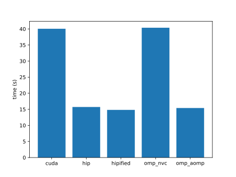 |
| mcmd | 14.42 | 110.17 | 110.50 | 16.27 | 110.62 |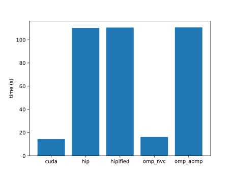 |
| mcpr | 12.75 | 60.69 | 60.66 | 14.44 | 67.98 | |
| md | 18.53 | 19.47 | 19.51 | 18.97 | 18.84 | |
| md5hash | 17.24 | 33.47 | 33.46 | 17.22 | 41.39 | |
| mdh | 87.25 | 217.07 | build err | 40.38 | 218.96 | |
| meanshift | 5.64 | 3.15 | 3.38 | 6.88 | 3.04 | |
| medianfilter | 6.10 | 15.03 | 15.32 | 7.23 | 4.27 | |
| memcpy | 7.45 | 19.46 | 19.69 | 8.45 | 18.21 | |
| memtest | 20.17 | 28.04 | 28.04 | 21.57 | 38.18 | |
| merge | 1657.99 | 1798.11 | 1799.55 | 1623.48 | 1814.24 | |
| merkle | 8.14 | 15.19 | 15.58 | -- | -- | |
| metropolis | 1511.71 | 71.73 | build err | TLE error | TLE error | |
| mf-sgd | build err | 0.33 | 0.33 | -- | -- | |
| michalewicz | 48.89 | 130.13 | 130.26 | TLE error | 138.14 | |
| miniDGS | exe err | -- | exe err | -- | -- | |
| miniFE | 9.03 | 10.13 | 10.35 | 10.11 | 10.31 | |
| miniWeather | 5.82 | 3.15 | 3.12 | 6.34 | 64.82 | |
| minibude | 3.33 | 2.44 | 2.46 | 5.55 | 3.06 | |
| minimap2 | 5.23 | build err | 1.76 | 4.98 | 13.85 | |
| minimod | 5.82 | 2.85 | 2.86 | -- | -- | |
| minisweep | 80.75 | 91.70 | 92.92 | exe err | 2.97 | |
| minkowski | 25.36 | 24.16 | 31.66 | 23.81 | 89.66 | |
| minmax | 221.71 | 231.56 | 230.54 | -- | -- | |
| mis | 95.76 | 0.47 | 0.47 | exe err | TLE error | |
| mixbench | 9.17 | 50.64 | 50.64 | 9.88 | 53.22 | |
| mmcsf | 7.62 | 8.10 | 8.14 | -- | -- | |
| mnist | 20.00 | 70.23 | 71.51 | -- | -- | |
| morphology | 26.72 | 3.10 | 3.10 | TLE error | 0.92 | |
| mpc | 8.55 | 0.38 | exe err | -- | -- |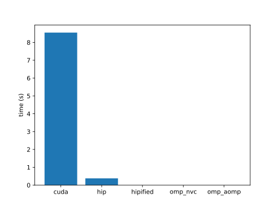 |
| mr | 4.85 | 1.28 | 1.28 | exe err | 2.39 | |
| mrc | 85.53 | 4.17 | 4.12 | TLE error | 5.53 | |
| mrg32k3a | 209.77 | 128.15 | 128.06 | -- | -- | |
| mriQ | 4.34 | 6.77 | 27.77 | 5.10 | 30.97 | |
| mt | 5.24 | 4.61 | 4.63 | 4.44 | 4.26 | |
| mtf | 12.27 | 20.05 | 20.00 | -- | -- | |
| multimaterial | 28.21 | 16.72 | 16.87 | 25.84 | 83.99 | |
| multinomial | 6.26 | 1.73 | 1.74 | -- | -- | |
| murmurhash3 | 2.72 | 2.87 | 2.89 | 4.52 | 23.13 | |
| myocyte | 34.40 | 69.84 | 87.86 | 12.58 | 13.34 | |
| nbnxm | 4.78 | 8.56 | TLE error | -- | -- | |
| nbody | 46.57 | 0.49 | 0.49 | 64.85 | 0.70 | |
| ne | 4.86 | 3.17 | 3.18 | 4.58 | 3.79 | |
| nlll | 52.01 | 149.47 | 149.47 | TLE error | 146.98 | |
| nms | 4.37 | 0.61 | 0.60 | exe err | 1.31 | |
| nn | 4.28 | 0.48 | 0.47 | 4.19 | 0.73 | |
| nonzero | 49.52 | 32.19 | 32.14 | -- | -- | |
| norm2 | 3.67 | 3.51 | 3.39 | 4.98 | 5.07 | |
| nosync | 9.43 | 5.41 | 7.49 | -- | -- | |
| nqueen | 7.87 | 37.42 | 37.24 | 8.55 | 28.63 | |
| ntt | 8.20 | 7.76 | 7.74 | 8.87 | 10.11 | |
| nw | 10.16 | 2.66 | 2.64 | 23.34 | 2.96 | |
| openmp | 15.40 | 66.84 | 66.87 | 15.35 | 77.52 | |
| opticalFlow | 5.66 | 3.03 | exe err | -- | -- | |
| overlap | 4.19 | 0.56 | build err | -- | -- | |
| overlay | 5.80 | 4.28 | 4.28 | 10.60 | 20.40 | |
| p2p | 3.92 | 0.77 | 0.76 | -- | -- | |
| p4 | 5.39 | 7.95 | 8.24 | 627.37 | 3.29 | |
| pad | 292.22 | 1.97 | build err | -- | -- | |
| page-rank | 25.46 | 25.72 | 25.69 | 25.80 | 24.79 |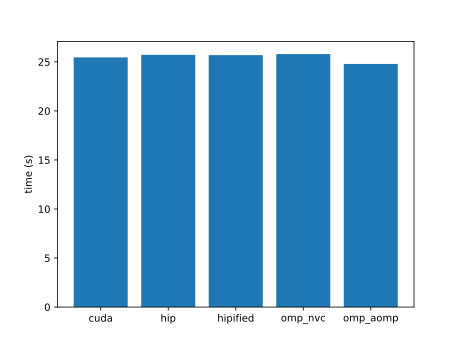 |
| particle-diffusion | 12.92 | 9.68 | 9.66 | 12.89 | 13.59 | |
| particlefilter | 6.10 | 2.41 | 2.39 | exe err | 4.97 | |
| particles | 5.35 | 1.99 | 1.99 | TLE error | exe err | |
| pathfinder | 53.00 | 1.35 | 1.35 | exe err | 0.97 | |
| pcc | 5.21 | 8.05 | 8.06 | -- | -- |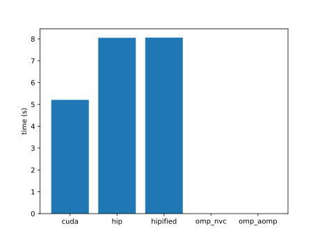 |
| perlin | 10.29 | 13.10 | 13.06 | -- | -- | |
| permutate | 28.86 | 34.37 | 34.49 | 28.04 | 34.79 | |
| permute | 40.01 | 1.03 | 1.03 | 41.56 | 2.20 | |
| perplexity | 279.74 | 2.46 | 2.43 | 214.51 | 2.73 | |
| phmm | 5.37 | 93.71 | 93.71 | 9.49 | 19.23 | |
| pingpong | 252.47 | build err | build err | -- | -- | |
| pitch | 5.35 | 4.11 | 4.11 | -- | -- |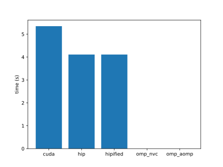 |
| pnpoly | 6.94 | 20.91 | 20.91 | 118.97 | 226.78 | |
| pns | 6.69 | 7.48 | 7.48 | exe err | 0.23 | |
| pointwise | 25.07 | 1.96 | 3.06 | 171.66 | exe err | |
| pool | 30.62 | 11.83 | 11.83 | 39.38 | 21.57 | |
| popcount | 838.56 | 4.31 | 4.30 | 175.36 | 13.34 | |
| prefetch | 6.99 | 71.78 | 227.44 | -- | -- | |
| present | 6.93 | 4.64 | 4.64 | 6.99 | 4.65 | |
| prna | 81.94 | 512.73 | 518.59 | exe err | 556.08 | |
| projectile | 4.75 | 1.39 | 1.09 | 4.69 | 4.29 | |
| pso | 4.71 | 1.39 | 1.37 | 4.45 | 1.92 | |
| qem | 7.77 | 11.50 | 11.90 | -- | -- | |
| qkv | 19.18 | 13.98 | 13.93 | -- | -- | |
| qrg | 7.15 | 20.03 | 20.03 | 10.33 | 30.61 | |
| qtclustering | 38.31 | 0.94 | 0.94 | exe err | exe err | |
| quicksort | 40.20 | 51.31 | 51.09 | exe err | 49.43 | |
| radixsort | 2.91 | 1.69 | 1.68 | 8.22 | 5.00 | |
| radixsort2 | 8.56 | 101.95 | 101.90 | -- | -- | |
| rainflow | 42.50 | 7.21 | 7.21 | 38.72 | 3.84 | |
| randomAccess | 9.99 | 14.06 | 13.91 | 26.06 | 9.01 | |
| rayleighBenardConvection | 32.25 | 42.94 | 46.43 | -- | -- | |
| reaction | 1.88 | 5.94 | 5.95 | 9.53 | 22.70 | |
| recursiveGaussian | 5.60 | 4.37 | 4.38 | exe err | exe err | |
| relu | 1026.76 | 18.84 | build err | -- | -- | |
| remap | 46.57 | 22.12 | 21.89 | -- | -- | |
| resize | 208.50 | 7.80 | 7.80 | exe err | 8.67 | |
| resnet-kernels | 26.28 | 3.98 | 1.03 | -- | -- | |
| reverse | 3.39 | 1.61 | 1.70 | 7.93 | 10.46 | |
| reverse2D | 33.68 | 1.45 | 2.66 | -- | -- | |
| rfs | 357.77 | 13.29 | 13.14 | exe err | 12.78 |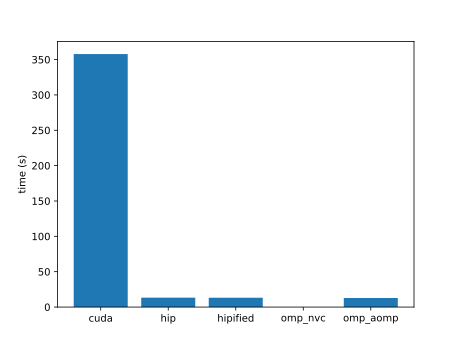 |
| ring | 9.13 | 5.73 | 5.72 | -- | -- | |
| rle | 108.12 | 0.68 | build err | -- | -- | |
| rng-wallace | 4.78 | 1.61 | 1.60 | 5.70 | 1.77 | |
| rodrigues | 400.05 | 0.95 | 0.95 | 299.68 | 5.43 | |
| romberg | 2.68 | 1.11 | 1.10 | 4.57 | 0.94 | |
| rotary | 2.43 | 0.75 | 0.73 | -- | -- | |
| rowwiseMoments | 203.27 | 2.43 | 2.43 | -- | -- | |
| rsbench | 4.66 | 3.73 | 3.74 | exe err | 2.71 | |
| rsc | 4.29 | 0.85 | 0.90 | 4.38 | 0.85 | |
| rsmt | 9.03 | -- | build err | -- | -- | |
| rtm8 | 6.17 | 3.83 | 3.96 | 6.15 | 4.58 | |
| rushlarsen | 684.29 | 11.16 | 11.08 | 688.86 | 11.25 | |
| s3d | 6.53 | 0.64 | 0.62 | 9.14 | 3.42 | |
| s8n | 1206.32 | 28.46 | 28.40 | 1268.07 | 56.50 | |
| sa | 83.02 | 2.50 | 2.49 | -- | -- | |
| sad | 4.61 | 2.08 | 2.08 | over 300 | 2.10 | |
| sampling | 7.49 | 7.76 | 7.75 | 8.85 | 2.15 | |
| saxpy-ompt | exe err | 53.86 | 53.08 | -- | -- | |
| sc | TLE error | 1.14 | build err | -- | -- | |
| scan | 620.44 | 111.13 | 110.57 | 762.38 | 104.33 | |
| scan2 | 5.11 | 1.37 | 1.38 | 8.98 | 4.09 | |
| scan3 | 5.17 | 1.30 | 1.27 | -- | -- | |
| scel | 16.97 | 46.08 | 89.70 | 724.30 | 47.40 | |
| score | 12.04 | 4.73 | exe err | -- | -- | |
| sddmm-batch | 207.90 | 213.08 | 212.23 | -- | -- | |
| seam-carving | 4.22 | 0.48 | 0.48 | -- | -- | |
| secp256k1 | 4.62 | 1.28 | 1.28 | 4.42 | 0.18 | |
| segment-reduce | 149.02 | 8.57 | 8.60 | -- | -- | |
| segsort | 9.35 | 6.37 | build err | -- | -- | |
| sheath | 7.26 | 4.93 | 486.06 | 7.54 | 327.06 | |
| shmembench | 6.89 | 5.68 | 5.68 | exe err | 1.11 | |
| shuffle | 8.89 | 7.95 | build err | -- | -- | |
| si | 8.51 | 1.21 | build err | -- | -- | |
| simpleMultiDevice | 5.39 | 6.78 | 6.82 | -- | -- | |
| simpleSpmv | 2291.54 | 13.45 | build err | 2110.89 | 10.00 | |
| simplemoc | 232.48 | 4.38 | 4.30 | 1234.66 | 1261.04 | |
| slit | 4.33 | build err | build err | -- | -- | |
| slu | build err | 20.95 | 20.94 | build err | 27.24 | |
| snake | 9.84 | 13.48 | 13.49 | 12.36 | 16.13 | |
| sobel | 4.69 | 1.29 | 1.35 | 5.29 | 6.36 | |
| sobol | 6.27 | 3.27 | 3.27 | 6.32 | 3.07 | |
| softmax | 43.51 | 29.39 | build err | 45.71 | 116.69 | |
| softmax-fused | 4.55 | 9.19 | build err | -- | -- | |
| softmax-online | 30.85 | 20.58 | build err | -- | -- | |
| sort | 7.01 | 6.06 | 6.05 | 39.25 | exe err | |
| sortKV | 363.11 | 39.88 | 39.58 | -- | -- | |
| sosfil | 5.99 | 6.63 | 6.62 | 15.29 | 10.23 | |
| sparkler | 6.27 | 7.14 | 7.13 | -- | -- | |
| spaxpby | 1172.55 | 64.45 | 65.22 | -- | -- |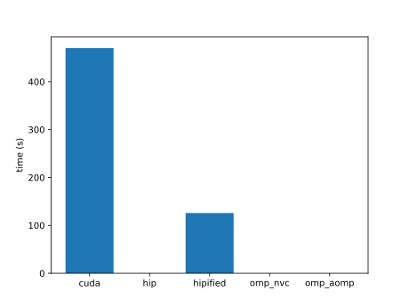 |
| spd2s | 2649.11 | 114.44 | 118.63 | -- | -- | |
| spgeam | 71.22 | 19.41 | 19.45 | -- | -- | |
| spgemm | 1046.42 | 16.67 | 16.51 | -- | -- | |
| sph | 7.19 | 3.06 | 3.06 | 7.28 | 3.76 | |
| split | 50.64 | 1.25 | 1.25 | 187.37 | exe err | |
| spm | 181.14 | 2.14 | 2.14 | 177.96 | 3.33 | |
| spmm | 12.19 | 7.10 | 7.16 | -- | -- | |
| spmv | 2523.57 | 6.16 | 6.13 | -- | -- | |
| spnnz | 407.44 | 107.15 | 106.60 | -- | -- | |
| sps2d | 1636.62 | 118.07 | 118.92 | -- | -- | |
| spsm | 123.23 | 117.88 | build err | -- | -- | |
| spsort | 333.51 | 103.84 | 104.25 | -- | -- | |
| sptrsv | 4.73 | 1.50 | 1.70 | 4.82 | 2.12 | |
| srad | 62.96 | 54.97 | 54.89 | 183.00 | 64.05 | |
| ss | 9.03 | 6.31 | 6.31 | 19.89 | 922.90 | |
| ssim | 6.04 | 6.66 | 6.65 | -- | -- | |
| sss | 34.11 | 7.16 | 7.15 | -- | -- | |
| sssp | 11.10 | 13.02 | 13.20 | -- | -- | |
| stddev | 49.52 | 24.36 | 33.47 | 52.98 | 38.77 | |
| stencil1d | 5.44 | 2.62 | 2.66 | 59.09 | 37.35 | |
| stencil3d | 20.34 | 6.76 | 6.70 | exe err | 1.32 | |
| streamCreateCopyDestroy | 5.74 | 17.13 | 17.18 | -- | -- | |
| streamOrderedAllocation | 6.60 | 18.78 | 19.47 | -- | -- | |
| streamPriority | 4.65 | 2.84 | 1.44 | -- | -- | |
| streamUM | 43.61 | 32.24 | 28.33 | -- | -- | |
| streamcluster | 20.70 | 26.78 | 31.44 | build err | exe err | |
| stsg | 25.65 | 208.03 | 207.85 | -- | -- | |
| su3 | 9.93 | 2.28 | 2.28 | 25.95 | 3.02 | |
| surfel | 2178.24 | 10.46 | 10.46 | 2425.75 | 179.57 | |
| svd3x3 | 5.90 | 2.71 | 2.82 | 5.92 | 2.71 | |
| sw4ck | 6.43 | 25.07 | 24.92 | exe err | 193.21 | |
| swish | 26.70 | 2.86 | 2.15 | 1427.21 | 2.34 | |
| tensorAccessor | 60.39 | 17.51 | 17.51 | -- | -- | |
| tensorT | 4.64 | 1.81 | 1.82 | 4.84 | 7.44 | |
| testSNAP | 5.77 | 5.85 | 5.72 | 6.07 | 0.50 | |
| thomas | 1573.13 | 17.48 | 17.45 | 1390.69 | 23.93 | |
| threadfence | 34.79 | 0.87 | 0.85 | 37.17 | 0.50 | |
| tissue | 13.77 | 21.07 | 21.06 | 15.19 | 19.99 | |
| tonemapping | 5.15 | 10.71 | 10.71 | 4.92 | 11.03 | |
| tpacf | 12.33 | 15.83 | build err | -- | -- | |
| tqs | 4.38 | 1.64 | 1.66 | exe err | exe err | |
| triad | 4.45 | 1.42 | 1.42 | 4.53 | 2.86 | |
| tridiagonal | 91.46 | 27.51 | 27.29 | 161.09 | 36.25 | |
| tsa | 1266.41 | 1.95 | 1.78 | 1484.54 | 1.82 | |
| tsne | build err | build err | build err | -- | -- | |
| tsp | 6.72 | 10.86 | 14.42 | build err | 10.82 | |
| unfold | 39.14 | 0.59 | 0.60 | -- | -- | |
| urng | 4.21 | 0.45 | 0.45 | 4.36 | 0.79 | |
| vanGenuchten | 31.55 | 5.64 | 5.62 | 44.96 | 6.03 | |
| vmc | 4.57 | 1.80 | 1.81 | exe err | 1.69 | |
| vol2col | 8.24 | 10.06 | 10.03 | 7.95 | exe err | |
| vote | 5.56 | 12.21 | build err | -- | -- | |
| voxelization | 12.13 | 94.01 | 94.05 | -- | -- | |
| warpexchange | 51.19 | 0.67 | 0.66 | -- | -- | |
| warpsort | 5.79 | 1.20 | build err | -- | -- | |
| wedford | 198.58 | 15.38 | build err | -- | -- | |
| winograd | 4.70 | 0.96 | 0.96 | 4.82 | 3.51 | |
| wlcpow | 6.25 | 8.22 | 7.90 | 16.99 | 8.79 | |
| wmma | 103.29 | 5.04 | build err | -- | -- | |
| word2vec | 13.15 | 23.95 | 23.96 | -- | -- | |
| wordcount | 21.50 | 9.01 | 9.01 | 20.92 | 8.53 | |
| wsm5 | 7.28 | 9.75 | 9.73 | 9.99 | 10.72 | |
| wyllie | 755.63 | 468.16 | 440.62 | over 800 | 441.99 | |
| xlqc | 4.22 | 0.48 | 0.47 | 4.14 | 0.48 | |
| xsbench | 48.31 | 55.05 | 43.60 | 6.98 | 27.78 | |
| zerocopy | 21.70 | 114.24 | 988.62 | -- | -- | |
| zeropoint | 18.85 | 151.86 | 151.68 | 1443.93 | 152.91 | |
| zmddft | 4.46 | 3.77 | 3.78 | 18.94 | 3.10 | |
| zoom | 40.79 | 8.17 | 8.14 | -- | -- | |
