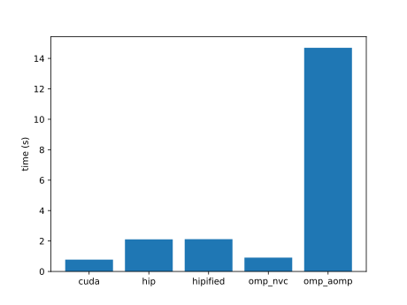
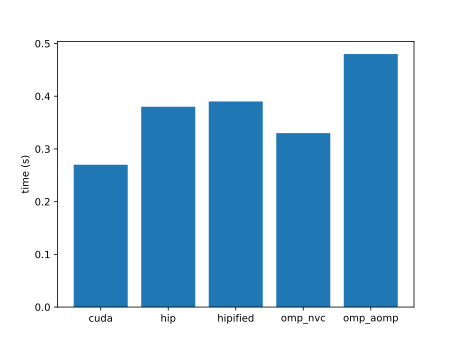
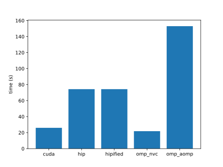
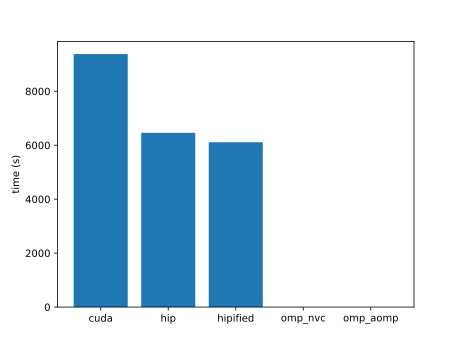
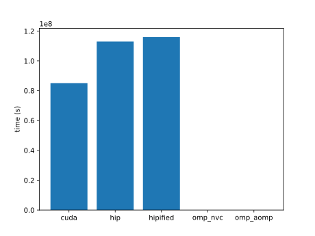

| name | cuda | hip | hipified | omp_nvc | omp_aomp | plot |
|  --  |  --  | --  |   --     |   --    |    --    | -- |
|accuracy|613.827346 |1257.1344900000001 |1257.368896 |6405.215088000001 |41896.416504 | |
|ace|6998.048 |2667.294 |2661.283 |3050.935 | | |
|adam|0.07193 |0.23091 |0.232033 |0.103336 | | |
|addBiasResidualLayerNorm| | | | | | |
|adv|3829080.0 |82686500.0 |84727000.0 |6045730.0 |2973980.0 | |
|aes| | | | | | |
|affine| | | | | | |
|aidw|0.0075780000000000005 |0.040574 |0.23113 |0.009131 |0.002271 | |
|aligned-types| | | | | | |
|all-pairs-distance|143.77259800000002 |1818.950241 |1818.0818629999999 |1575.9076 |282.0929 | |
|allreduce| | | | | | |
|amgmk| | | | | | |
|ans| | | | | | |
|aobench|0.021904 |0.00403 |0.004025 |0.053352 |1.10104 | |
|aop|4.16 |6.45 | |8.67 | | |
|asmooth|0.00519 |0.017152 |0.026289 |0.006483 | | |
|assert| | | | | | |
|asta|0.015259 |0.023226 |0.023275 |0.068213 | | |
|atan2| | | | | | |
|atomicAggregate|1.234833 |1.683988 | | | | |
|atomicCAS|13.175372000000001 |13.927821000000002 |14.395844 | | | |
|atomicCost|10896.009583000001 |24588.055419999997 |25554.682404000003 |14010.849243 |924721.865234 | |
|atomicIntrinsics| | | | | | |
|atomicPerf| | | | | | |
|atomicReduction|51011.95999999999 |24642.298000000003 |24667.574999999993 | |5285.851499999999 | |
|atomicSystemWide| | | | | | |
|attention|9.257616 |66.017735 | | | | |
|attentionMultiHead| | | | | | |
|axhelm| | | | | | |
|b+tree| | | | | | |
|babelstream| | | | | | |
|background-subtract| | | | | | |
|backprop|2.383219 |0.380395 |0.379845 |2.806096 |0.07095 | |
|bezier-surface|88.0 |175.0 |175.0 |94.0 | | |
|bfs| | | | | | |
|bh|3.754 | | | | | |
|bicgstab| | | | | | |
|bilateral|4.960835 |16.613675999999998 |16.619774 |5.45366 | | |
|bincount| | | | | | |
|binomial|2749.141357 |1382.229248 |1390.380371 | | | |
|bitcracker| | | | | | |
|bitonic-sort|33.025303 |86.87162 |86.812935 |54.935398 | | |
|bitpacking|4.092396 |2.690068 |2.693254 | | | |
|bitpermute| | | | | | |
|black-scholes|4712.842285 |548.144409 |547.945435 |3253.465088 |-50.086426 | |
|blas-dot| | | | | | |
|blas-fp8gemm| | | | | | |
|blas-gemm| | | | | | |
|blas-gemmBatched| | | | | | |
|blas-gemmEx| | | | | | |
|blas-gemmEx2| | | | | | |
|blas-gemmStridedBatched| | | | | | |
|blockAccess| | | | | | |
|blockexchange| | | | | | |
|bm3d| | | | | | |
|bmf| | | | | | |
|bn|0.160338 | | | | | |
|bonds|45.51579 |115.85106 |115.93597 |82.10526 |71.94878 | |
|boxfilter|438.520493 |871.838043 | |711.7890930000001 |3718.077393 | |
|bscan| | | | | | |
|bsearch|6.75953 |0.040439499999999996 |0.0404387 | | | |
|bspline-vgh|0.128703 |0.418555 |0.414225 |0.129096 |3.362063 | |
|bsw| | | | | | |
|btree| | | | | | |
|burger|0.564043 |0.407012 |0.406624 |0.754948 | | |
|bwt|329594.0 |1612.0 |1658.0 | |2832.0 | |
|car| | | | | | |
|cbsfil|0.036594 |0.01827 |0.018271 |0.056886 | | |
|cc| | | | | | |
|ccl| | | | | | |
|ccs| | | | | | |
|ccsd-trpdrv|0.364778 |0.18976 |0.191538 |0.309671 |2.032303 | |
|ced| | | | | | |
|cfd| | | | | | |
|chacha20| | | | | | |
|channelShuffle|24.042852000000003 |47.487351999999994 |47.170039 |49.201341 |513.115193 | |
|channelSum|62.827003000000005 |150.10787100000002 |150.100805 |86.925266 | | |
|che| | | | | | |
|chemv|658.573853 |1466.981201 |1467.283447 |782.601685 | | |
|chi2| | | | | | |
|clenergy|0.212417 |0.865782 |0.86552 |0.738999 |17.259947 | |
|clink|31.3712 |87.8747 |87.3701 |32.7192 |484.924 | |
|clock| | | | | | |
|cm| | | | | | |
|cmembench| | | | | | |
|cmp| | | | | | |
|cobahh|46951.582031 | | | | | |
|collision| | | | | | |
|colorwheel| | | | | | |
|columnarSolver| | | | | | |
|complex|0.009966 |0.00141 |0.00141 |0.01046 |0.025756 | |
|compute-score|0.637546 |3.619386 |3.621922 |1.788935 | | |
|concat|2982.020446 |6404.663361 |6403.787963999999 |4010.182648 |51642.337403 | |
|concurrentKernels|280.417 |31.534 |31.533 | | | |
|contract| | | | | | |
|conversion| | | | | | |
|convolution1D| | | | | | |
|convolution3D| | | | | | |
|convolutionDeformable| | | | | | |
|convolutionSeparable|0.002296 |0.001218 |0.001218 |0.011509 | | |
|cooling|1158.704834 |0.220044 |0.411434 |20.817062 | | |
|coordinates| | | | | | |
|copy| | | | | | |
|crc64| | | | | | |
|cross| |2732.1855780000005 |2737.7408450000003 | | | |
|crossEntropy|1.0295260000000002 |4.004385 |4.020346 | | | |
|crs|154.212017 |0.748026 |0.746147 | |0.293732 | |
|d2q9-bgk| | | | | | |
|d3q19-bgk| | | | | | |
|damage| | | | | | |
|daphne| | | | | | |
|dct8x8|0.009453 |0.000569 |0.00057 | | | |
|ddbp| | | | | | |
|debayer| | | | | | |
|degrid|0.0131097 |0.0548846 | |0.0355786 |0.649087 | |
|dense-embedding|23681.990631999997 |29923.951904999998 |29936.109223 |38874.884187999996 | | |
|depixel| | | | | | |
|deredundancy| | | | | | |
|determinant| | | | | | |
|diamond| | | | | | |
|dispatch| | | | | | |
|distort| | | | | | |
|divergence| | | | | | |
|doh| | | | | | |
|dp| | | | | | |
|dpid| | | | | | |
|dropout| | | | | | |
|dslash| | | | | | |
|dwconv|50.836926000000005 |101.76284100000001 |101.55184899999999 | | | |
|dwconv1d| | | | | | |
|dxtc1| | | | | | |
|dxtc2|338.945465 |498.416962 | | | | |
|easyWave| | | | | | |
|ecdh|0.118928 |0.026141 |0.026170000000000002 |0.15334899999999999 |0.432298 | |
|egs| | | | | | |
|eigenvalue|21.3852 |1252.08 |1249.38 | |1600.55 | |
|eikonal| | | | | | |
|entropy|0.048917 |0.017444 |0.017443 |0.06117 | | |
|epistasis|0.0200987 |0.0455015 |0.0455369 |0.127904 | | |
|ert|5.290021 |3.364853 |3.369315 | | | |
|expdist|0.0033150000000000002 |0.003316 |0.0033179999999999998 |0.008974 | | |
|extend2|2512.021973 |5299.974121 |5301.911133 |2211.602051 | | |
|extrema| | | | | | |
|f16max| | | | | | |
|f16sp| | | | | | |
|face| | | | | | |
|fdtd3d|0.000494 |0.000255 |0.000255 |0.004754 |0.001907 | |
|feynman-kac| | | | | | |
|fft|0.000369513 |0.00331896 |0.00332055 |0.00117655 |0.00187262 | |
|fhd| | | | | | |
|filter|6.236772 |0.801315 |0.795328 | | | |
|flame| | | | | | |
|flip|52.122066000000004 |40.056522 |40.14744 |98.080399 |399.810348 | |
|floydwarshall|0.202779 |0.008974 |0.008986 |0.455618 |0.047847 | |
|floydwarshall2| | | | | | |
|fluidSim| | | | | | |
|fpc|0.011363 |0.002576 |0.002575 | |1e-05 | |
|fpdc| | | | | | |
|frechet| | | | | | |
|fresnel| | | | | | |
|frna| | | | | | |
|fsm|0.119993 |0.655926 |0.655975 | |0.019343 | |
|fwt|0.000682 | |0.001328 |0.001624 | | |
|ga| | | | | | |
|gabor|21525.683594 |2354.365967 |2684.912109 | | | |
|gamma-correction|0.003628 |0.00038 |0.000382 |0.005546 |0.004128 | |
|gaussian|3200242.0 |896489.0 |889341.0 |3350200.0 | | |
|gc| | | | | | |
|gd|0.4116 |1.990289 |17.904823 | | | |
|ge-spmm| | | | | | |
|geam| | | | | | |
|gels| | | | | | |
|gelu|14.234483 |22.021839 |21.799202 | | | |
|gemv| | | | | | |
|geodesic| | | | | | |
|gerbil| | | | | | |
|gibbs| | | | | | |
|glu|18559.277833 |23506.471191 |23036.444336 |24905.168944999998 | | |
|gmm| | | | | | |
|goulash|1.252459 |0.680476 |0.659229 |1.797422 |8.404848 | |
|gpp|0.227251 |23.763157 |23.335592 |0.172057 |2.963458 | |
|graphB+| | | | | | |
|graphExecution| | | | | | |
|grep| | | | | | |
|grrt| | | | | | |
|gru| | | | | | |
|haccmk|0.00211 |0.003754 |0.003754 |0.001966 |0.004908 | |
|halo-finder| | | | | | |
|hausdorff|6.445428 |17.372002 |17.381919 |7.213632 |34.793795 | |
|haversine| | | | | | |
|hbc| | | | | | |
|heartwall| | | | | | |
|heat| | | | | | |
|heat2d| | | | | | |
|hellinger| | | | | | |
|henry| | | | | | |
|hexciton| | | | | | |
|histogram|337.019 |710.2740000000001 |710.629 |785.2139999999999 |7889.789 | |
|hmm|0.141498 |0.492939 |0.492873 |0.185121 |1.03994 | |
|hogbom| | | | | | |
|hotspot| | | | | | |
|hotspot3D| | | | | | |
|hpl| | | | | | |
|hungarian| | | | | | |
|hwt1d|0.0152943 |0.0312006 |0.0310979 |0.0162016 |0.0296087 | |
|hybridsort|2363.0 |554.0 |557.0 |3572.0 |295.0 | |
|hypterm| | | | | | |
|idivide| | | | | | |
|interleave| | | | | | |
|interval| | | | | | |
|intrinsics-cast| | | | | | |
|intrinsics-simd| | | | | | |
|inversek2j|0.051461 |0.168865 |0.169663 |7.51291 |23.9558 | |
|is| | | | | | |
|ising|1.233481 |3.141379 |3.141908 |2.132788 |9.459265 | |
|iso2dfd|23.7052 |167.397 |167.82 |35.9151 |278.194 | |
|jaccard| | | | | | |
|jacobi|2.633 |8.745 | |3.233 |12.7 | |
|jenkins-hash|0.003057 |0.011288 |0.01142 |2.699578 |1.179207 | |
|kalman| | | | | | |
|keccaktreehash| | | | | | |
|keogh| | | | | | |
|kernelLaunch| | | | | | |
|kmc| | | | | | |
|kmeans| | | | | | |
|knn| | | | | | |
|kurtosis| | | | | | |
|lanczos| | | | | | |
|langevin| | | | | | |
|langford| | | | | | |
|laplace|1.117245 |3.552777 |3.547606 |4.670623 |20.650784 | |
|laplace3d| | | | | | |
|lavaMD| | | | | | |
|layernorm| | | | | | |
|layout|133.197 |193.768 |193.977 |87.8688 |445.62 | |
|lci| | | | | | |
|lda| | | | | | |
|ldpc| | | | | | |
|lebesgue| | | | | | |
|leukocyte| | | | | | |
|lfib4| | | | | | |
|libor|0.0029490000000000002 |0.008716 |0.008726000000000001 |0.0033090000000000003 |0.013325 | |
|lid-driven-cavity| | | | | | |
|lif|13723.242 |31463.439 |41791.463 |11124.294 |57279.168 | |
|linearprobing|0.001772 |0.000869 |0.000865 | | | |
|log2| | | | | | |
|logan| | | | | | |
|logic-resim| | | | | | |
|logic-rewrite| | | | | | |
|logprob|6485.145508 |13621.458008 | | | | |
|lombscargle|290.15523 |503.00491 |502.06531 |213.35224 |718.59981 | |
|loopback| | | | | | |
|lr| | | | | | |
|lrn| | | | | | |
|lsqt| | | | | | |
|lud| | | | | | |
|ludb| | | | | | |
|lulesh| | | | | | |
|lzss| | | | | | |
|mallocFree| | | | | | |
|mandelbrot|0.0567399 |0.166982 |0.166828 |0.0629887 |0.297777 | |
|marchingCubes| | | | | | |
|mask|5719077.119003001 |1363.270045 |1441.40004 |62133.598634 |190191.5625 | |
|match| | | | | | |
|matern| | | | | | |
|matrix-rotate|0.070534 |0.79245 |0.807797 |0.068323 |0.784194 | |
|matrixT| | | | | | |
|maxFlops| | | | | | |
|maxpool3d|0.003626 |0.015668 |0.015476 |0.007347 |0.029201 | |
|mcmd| | | | | | |
|mcpr| | | | | | |
|md|6.67878e-05 |0.000246608 |0.000246666 |7.20637e-05 |0.000272715 | |
|md5hash| | | | | | |
|mdh| | | | | | |
|meanshift|0.457261 |1.42863 |1.50785 |1.08917 |1.2615 | |
|medianfilter|7.6e-05 |0.000161 |0.00016 |0.000242 |0.00036 | |
|memcpy| | | | | | |
|memtest| | | | | | |
|merge|224298.55965300003 |550146.512131 |549995.701124 |540389.017667 |803069.6961439999 | |
|merkle| |2368.4669999999996 | | | | |
|metropolis| | | | | | |
|mf-sgd| | | | | | |
|michalewicz| | | | | | |
|miniDGS| | | | | | |
|miniFE| | | | | | |
|miniWeather| | | | | | |
|minibude| | | | | | |
|minimap2| | | | | | |
|minimod|36.8049 |1.05659 |1.05663 | | | |
|minisweep|620.9630000000001 |90.501 |91.71100000000001 | |2.3890000000000002 | |
|minkowski|0.002435 |0.014728999999999999 |0.077424 | |0.669586 | |
|minmax| | | | | | |
|mis| | | | | | |
|mixbench| | | | | | |
|mmcsf| | | | | | |
|mnist| |75.885076 |74.46472 | | | |
|morphology| | | | | | |
|mpc| | | | | | |
|mr|67.67801399999999 |2.877789 |2.8987879999999997 | |646.101985 | |
|mrc| | | | | | |
|mrg32k3a| | | | | | |
|mriQ| | | | | | |
|mt| | | | | | |
|mtf| | | | | | |
|multimaterial| | | | | | |
|multinomial|1897.339355 |1873.757324 |1874.305298 | | | |
|murmurhash3|0.004479 |0.002043 |0.002044 | |0.00753 | |
|myocyte| | | | | | |
|nbnxm| |399.934143 | | | | |
|nbody| |0.0500785 |0.0502943 | |0.539727 | |
|ne| | | | | | |
|nlll| | | | | | |
|nms| | | | | | |
|nn| | | | | | |
|nonzero| | | | | | |
|norm2| | | | | | |
|nosync| | | | | | |
|nqueen| | | | | | |
|ntt| | | | | | |
|nw| | | | | | |
|openmp| | | | | | |
|opticalFlow| | | | | | |
|overlap| |1.753024 | | | | |
|overlay| | | | | | |
|p2p| | | | | | |
|p4| | | | | | |
|pad|281253.375 |1499.474121 | | | | |
|page-rank|0.38277 |2.958889 |3.090955 | | | |
|particle-diffusion| |0.0137502 |0.013655 | |0.0951051 | |
|particlefilter|3.378082 |2.328789 |2.315111 | |4.795917 | |
|particles| | | | | | |
|pathfinder|19.683741 |0.629906 |0.629681 | | | |
|pcc| | | | | | |
|perlin| | | | | | |
|permutate| | | | | | |
|permute| | | | | | |
|perplexity| | | | | | |
|phmm| | | | | | |
|pingpong| | | | | | |
|pitch| | | | | | |
|pnpoly| | | | | | |
|pns|34.12 |7.41 |7.41 | |0.07 | |
|pointwise| | | | | | |
|pool| | | | | | |
|popcount| | | | | | |
|prefetch| | | | | | |
|present| | | | | | |
|prna| | | | | | |
|projectile| | | | | | |
|pso| | | | | | |
|qem| | | | | | |
|qkv| | | | | | |
|qrg| | | | | | |
|qtclustering| | | | | | |
|quicksort| | | | | | |
|radixsort| | | | | | |
|radixsort2| | | | | | |
|rainflow| | | | | | |
|randomAccess| | | | | | |
|rayleighBenardConvection| | | | | | |
|reaction| | | | | | |
|recursiveGaussian| | | | | | |
|relu| | | | | | |
|remap| | | | | | |
|resize| | | | | | |
|resnet-kernels| | | | | | |
|reverse| | | | | | |
|reverse2D| | | | | | |
|rfs| | | | | | |
|ring| | | | | | |
|rle| | | | | | |
|rng-wallace| | | | | | |
|rodrigues| | | | | | |
|romberg| | | | | | |
|rotary| | | | | | |
|rowwiseMoments| | | | | | |
|rsbench| | | | | | |
|rsc|41952.734375 |326.95813 |328.610779 | | | |
|rsmt| | | | | | |
|rtm8| | | | | | |
|rushlarsen| | | | | | |
|s3d|2.5394140000000003 |0.573933 |0.556696 | |3.261443 | |
|s8n| | | | | | |
|sa| | | | | | |
|sad| | | | | | |
|sampling| | | | | | |
|saxpy-ompt| | | | | | |
|sc| |548.835571 | | | | |
|scan| | | | | | |
|scan2| | | | | | |
|scan3| | | | | | |
|scel| | | | | | |
|score| | | | | | |
|sddmm-batch| | | | | | |
|seam-carving| | | | | | |
|secp256k1| | | | | | |
|segment-reduce| | | | | | |
|segsort| | | | | | |
|sheath| |4.4 |485.0 | | | |
|shmembench| | | | | | |
|shuffle| | | | | | |
|si| | | | | | |
|simpleMultiDevice| | | | | | |
|simpleSpmv| | | | | | |
|simplemoc|156.638 |3.733 |3.714 | |124862.205 | |
|slit| | | | | | |
|slu| | | | | | |
|snake| | | | | | |
|sobel| | | | | | |
|sobol| | | | | | |
|softmax| | | | | | |
|softmax-fused| | | | | | |
|softmax-online| | | | | | |
|sort| | | | | | |
|sortKV| | | | | | |
|sosfil| | | | | | |
|sparkler| | | | | | |
|spaxpby| | | | | | |
|spd2s| | | | | | |
|spgeam| | | | | | |
|spgemm| | | | | | |
|sph| | | | | | |
|split| | | | | | |
|spm| | | | | | |
|spmm| | | | | | |
|spmv| | | | | | |
|spnnz| | | | | | |
|sps2d| | | | | | |
|spsm| | | | | | |
|spsort| | | | | | |
|sptrsv| | | | | | |
|srad| | | | | | |
|ss| | | | | | |
|ssim| | | | | | |
|sss| | | | | | |
|sssp| | | | | | |
|stddev| | | | | | |
|stencil1d| | | | | | |
|stencil3d| | | | | | |
|streamCreateCopyDestroy| | | | | | |
|streamOrderedAllocation| | | | | | |
|streamPriority| | | | | | |
|streamUM| | | | | | |
|streamcluster| | | | | | |
|stsg| | | | | | |
|su3| |1.521159 |1.521299 | | | |
|surfel| | | | | | |
|svd3x3| | | | | | |
|sw4ck| | | | | | |
|swish| | | | | | |
|tensorAccessor| | | | | | |
|tensorT| | | | | | |
|testSNAP| | | | | | |
|thomas| | | | | | |
|threadfence| | | | | | |
|tissue| | | | | | |
|tonemapping| | | | | | |
|tpacf| | | | | | |
|tqs| |1459.045288 |1483.624878 | | | |
|triad| | | | | | |
|tridiagonal| |0.21119 |0.20934 | | | |
|tsa| | | | | | |
|tsne| | | | | | |
|tsp| | | | | | |
|unfold| | | | | | |
|urng| | | | | | |
|vanGenuchten| |0.002223 |0.002223 | | | |
|vmc| | | | | | |
|vol2col| | | | | | |
|vote| | | | | | |
|voxelization| | | | | | |
|warpexchange| | | | | | |
|warpsort| | | | | | |
|wedford| | | | | | |
|winograd| | | | | | |
|wlcpow| | | | | | |
|wmma| | | | | | |
|word2vec| | | | | | |
|wordcount| | | | | | |
|wsm5| | | | | | |
|wyllie| | | | | | |
|xlqc| | | | | | |
|xsbench| | | | | | |
|zerocopy| |442.3760500000001 |319.44701499999996 | | | |
|zeropoint| |176.9142 |177.327988 | | | |
|zmddft| | | | | | |
|zoom| | | | | | |
