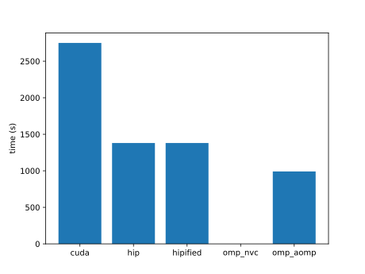
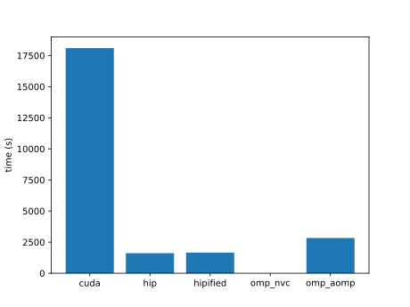
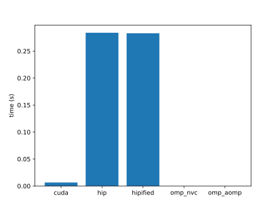
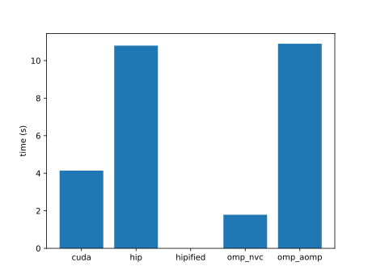
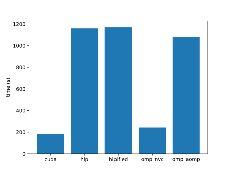
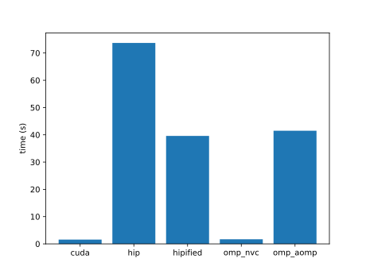
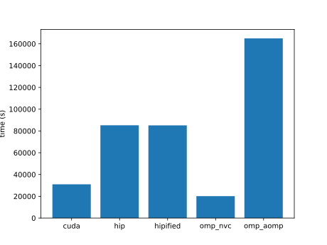
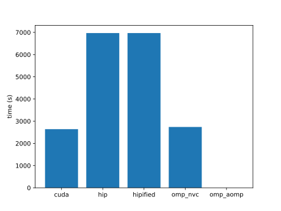

| name | cuda | hip | hipified | omp_nvc | omp_aomp | plot |
|  --  |  --  | --  |   --     |   --    |    --    | -- |
|accuracy|613.83 |1257.13 |1257.37 |6405.22 |41896.42 | |
|ace|6998.05 |2667.29 |2661.28 |3050.93 | | |
|adam|0.07 |0.23 |0.23 |0.10 | | |
|addBiasResidualLayerNorm| | | | | | |
|adv|3829080.00 |82686500.00 |84727000.00 |6045730.00 |2973980.00 | |
|aes| | | | | | |
|affine| | | | | | |
|aidw|0.01 |0.04 |0.23 |0.01 |0.00 | |
|aligned-types| | | | | | |
|all-pairs-distance|143.77 |1818.95 |1818.08 |1575.91 |282.09 | |
|allreduce| | | | | | |
|amgmk| | | | | | |
|ans| | | | | | |
|aobench|0.02 |0.00 |0.00 |0.05 |1.10 | |
|aop|4.16 |6.45 | |8.67 | | |
|asmooth|0.01 |0.02 |0.03 |0.01 | | |
|assert| | | | | | |
|asta|0.02 |0.02 |0.02 |0.07 | | |
|atan2| | | | | | |
|atomicAggregate|1.23 |1.68 | | | | |
|atomicCAS|13.18 |13.93 |14.40 | | | |
|atomicCost|10896.01 |24588.06 |25554.68 |14010.85 |924721.87 | |
|atomicIntrinsics| | | | | | |
|atomicPerf| | | | | | |
|atomicReduction|51011.96 |24642.30 |24667.57 | |5285.85 | |
|atomicSystemWide| | | | | | |
|attention|9.26 |66.02 | | | | |
|attentionMultiHead| | | | | | |
|axhelm| | | | | | |
|b+tree| | | | | | |
|babelstream| | | | | | |
|background-subtract| | | | | | |
|backprop|2.38 |0.38 |0.38 |2.81 |0.07 | |
|bezier-surface|88.00 |175.00 |175.00 |94.00 | | |
|bfs| | | | | | |
|bh|3.75 | | | | | |
|bicgstab| | | | | | |
|bilateral|4.96 |16.61 |16.62 |5.45 | | |
|bincount| | | | | | |
|binomial|2749.14 |1382.23 |1390.38 | | | |
|bitcracker| | | | | | |
|bitonic-sort|33.03 |86.87 |86.81 |54.94 | | |
|bitpacking|4.09 |2.69 |2.69 | | | |
|bitpermute| | | | | | |
|black-scholes|4712.84 |548.14 |547.95 |3253.47 |-50.09 | |
|blas-dot| | | | | | |
|blas-fp8gemm| | | | | | |
|blas-gemm| | | | | | |
|blas-gemmBatched| | | | | | |
|blas-gemmEx| | | | | | |
|blas-gemmEx2| | | | | | |
|blas-gemmStridedBatched| | | | | | |
|blockAccess| | | | | | |
|blockexchange| | | | | | |
|bm3d| | | | | | |
|bmf| | | | | | |
|bn|0.16 | | | | | |
|bonds|45.52 |115.85 |115.94 |82.11 |71.95 | |
|boxfilter|438.52 |871.84 | |711.79 |3718.08 | |
|bscan| | | | | | |
|bsearch|6.76 |0.04 |0.04 | | | |
|bspline-vgh|0.13 |0.42 |0.41 |0.13 |3.36 | |
|bsw| | | | | | |
|btree| | | | | | |
|burger|0.56 |0.41 |0.41 |0.75 | | |
|bwt|329594.00 |1612.00 |1658.00 | |2832.00 | |
|car| | | | | | |
|cbsfil|0.04 |0.02 |0.02 |0.06 | | |
|cc| | | | | | |
|ccl| | | | | | |
|ccs| | | | | | |
|ccsd-trpdrv|0.36 |0.19 |0.19 |0.31 |2.03 | |
|ced| | | | | | |
|cfd| | | | | | |
|chacha20| | | | | | |
|channelShuffle|24.04 |47.49 |47.17 |49.20 |513.12 | |
|channelSum|62.83 |150.11 |150.10 |86.93 | | |
|che| | | | | | |
|chemv|658.57 |1466.98 |1467.28 |782.60 | | |
|chi2| | | | | | |
|clenergy|0.21 |0.87 |0.87 |0.74 |17.26 | |
|clink|31.37 |87.87 |87.37 |32.72 |484.92 | |
|clock| | | | | | |
|cm| | | | | | |
|cmembench| | | | | | |
|cmp| | | | | | |
|cobahh|46951.58 | | | | | |
|collision| | | | | | |
|colorwheel| | | | | | |
|columnarSolver| | | | | | |
|complex|0.01 |0.00 |0.00 |0.01 |0.03 | |
|compute-score|0.64 |3.62 |3.62 |1.79 | | |
|concat|2982.02 |6404.66 |6403.79 |4010.18 |51642.34 | |
|concurrentKernels|280.42 |31.53 |31.53 | | | |
|contract| | | | | | |
|conversion| | | | | | |
|convolution1D| | | | | | |
|convolution3D| | | | | | |
|convolutionDeformable| | | | | | |
|convolutionSeparable|0.00 |0.00 |0.00 |0.01 | | |
|cooling|1158.70 |0.22 |0.41 |20.82 | | |
|coordinates| | | | | | |
|copy| | | | | | |
|crc64| | | | | | |
|cross| |2732.19 |2737.74 | | | |
|crossEntropy|1.03 |4.00 |4.02 | | | |
|crs|154.21 |0.75 |0.75 | |0.29 | |
|d2q9-bgk| | | | | | |
|d3q19-bgk| | | | | | |
|damage| | | | | | |
|daphne| | | | | | |
|dct8x8|0.01 |0.00 |0.00 | | | |
|ddbp| | | | | | |
|debayer| | | | | | |
|degrid|0.01 |0.05 | |0.04 |0.65 | |
|dense-embedding|23681.99 |29923.95 |29936.11 |38874.88 | | |
|depixel| | | | | | |
|deredundancy| | | | | | |
|determinant| | | | | | |
|diamond| | | | | | |
|dispatch| | | | | | |
|distort| | | | | | |
|divergence| | | | | | |
|doh| | | | | | |
|dp| | | | | | |
|dpid| | | | | | |
|dropout| | | | | | |
|dslash| | | | | | |
|dwconv|50.84 |101.76 |101.55 | | | |
|dwconv1d| | | | | | |
|dxtc1| | | | | | |
|dxtc2|338.95 |498.42 | | | | |
|easyWave| | | | | | |
|ecdh|0.12 |0.03 |0.03 |0.15 |0.43 | |
|egs| | | | | | |
|eigenvalue|21.39 |1252.08 |1249.38 | |1600.55 | |
|eikonal| | | | | | |
|entropy|0.05 |0.02 |0.02 |0.06 | | |
|epistasis|0.02 |0.05 |0.05 |0.13 | | |
|ert|5.29 |3.36 |3.37 | | | |
|expdist|0.00 |0.00 |0.00 |0.01 | | |
|extend2|2512.02 |5299.97 |5301.91 |2211.60 | | |
|extrema| | | | | | |
|f16max| | | | | | |
|f16sp| | | | | | |
|face| | | | | | |
|fdtd3d|0.00 |0.00 |0.00 |0.00 |0.00 | |
|feynman-kac| | | | | | |
|fft|0.00 |0.00 |0.00 |0.00 |0.00 | |
|fhd| | | | | | |
|filter|6.24 |0.80 |0.80 | | | |
|flame| | | | | | |
|flip|52.12 |40.06 |40.15 |98.08 |399.81 | |
|floydwarshall|0.20 |0.01 |0.01 |0.46 |0.05 | |
|floydwarshall2| | | | | | |
|fluidSim| | | | | | |
|fpc|0.01 |0.00 |0.00 | |0.00 | |
|fpdc| | | | | | |
|frechet| | | | | | |
|fresnel| | | | | | |
|frna| | | | | | |
|fsm|0.12 |0.66 |0.66 | |0.02 | |
|fwt|0.00 | |0.00 |0.00 | | |
|ga| | | | | | |
|gabor|21525.68 |2354.37 |2684.91 | | | |
|gamma-correction|0.00 |0.00 |0.00 |0.01 |0.00 | |
|gaussian|3200242.00 |896489.00 |889341.00 |3350200.00 | | |
|gc| | | | | | |
|gd|0.41 |1.99 |17.90 | | | |
|ge-spmm| | | | | | |
|geam| | | | | | |
|gels| | | | | | |
|gelu|14.23 |22.02 |21.80 | | | |
|gemv| | | | | | |
|geodesic| | | | | | |
|gerbil| | | | | | |
|gibbs| | | | | | |
|glu|18559.28 |23506.47 |23036.44 |24905.17 | | |
|gmm| | | | | | |
|goulash|1.25 |0.68 |0.66 |1.80 |8.40 | |
|gpp|0.23 |23.76 |23.34 |0.17 |2.96 | |
|graphB+| | | | | | |
|graphExecution| | | | | | |
|grep| | | | | | |
|grrt| | | | | | |
|gru| | | | | | |
|haccmk|0.00 |0.00 |0.00 |0.00 |0.00 | |
|halo-finder| | | | | | |
|hausdorff|6.45 |17.37 |17.38 |7.21 |34.79 | |
|haversine| | | | | | |
|hbc| | | | | | |
|heartwall| | | | | | |
|heat| | | | | | |
|heat2d| | | | | | |
|hellinger| | | | | | |
|henry| | | | | | |
|hexciton| | | | | | |
|histogram|337.02 |710.27 |710.63 |785.21 |7889.79 | |
|hmm|0.14 |0.49 |0.49 |0.19 |1.04 | |
|hogbom| | | | | | |
|hotspot| | | | | | |
|hotspot3D| | | | | | |
|hpl| | | | | | |
|hungarian| | | | | | |
|hwt1d|0.02 |0.03 |0.03 |0.02 |0.03 | |
|hybridsort|2363.00 |554.00 |557.00 |3572.00 |295.00 | |
|hypterm| | | | | | |
|idivide| | | | | | |
|interleave| | | | | | |
|interval| | | | | | |
|intrinsics-cast| | | | | | |
|intrinsics-simd| | | | | | |
|inversek2j|0.05 |0.17 |0.17 |7.51 |23.96 | |
|is| | | | | | |
|ising|1.23 |3.14 |3.14 |2.13 |9.46 | |
|iso2dfd|23.71 |167.40 |167.82 |35.92 |278.19 | |
|jaccard| | | | | | |
|jacobi|2.63 |8.74 | |3.23 |12.70 | |
|jenkins-hash|0.00 |0.01 |0.01 |2.70 |1.18 | |
|kalman| | | | | | |
|keccaktreehash| | | | | | |
|keogh| | | | | | |
|kernelLaunch| | | | | | |
|kmc| | | | | | |
|kmeans| | | | | | |
|knn| | | | | | |
|kurtosis| | | | | | |
|lanczos| | | | | | |
|langevin| | | | | | |
|langford| | | | | | |
|laplace|1.12 |3.55 |3.55 |4.67 |20.65 | |
|laplace3d| | | | | | |
|lavaMD| | | | | | |
|layernorm| | | | | | |
|layout|133.20 |193.77 |193.98 |87.87 |445.62 | |
|lci| | | | | | |
|lda| | | | | | |
|ldpc| | | | | | |
|lebesgue| | | | | | |
|leukocyte| | | | | | |
|lfib4| | | | | | |
|libor|0.00 |0.01 |0.01 |0.00 |0.01 | |
|lid-driven-cavity| | | | | | |
|lif|13723.24 |31463.44 |41791.46 |11124.29 |57279.17 | |
|linearprobing|0.00 |0.00 |0.00 | | | |
|log2| | | | | | |
|logan| | | | | | |
|logic-resim| | | | | | |
|logic-rewrite| | | | | | |
|logprob|6485.15 |13621.46 | | | | |
|lombscargle|290.16 |503.00 |502.07 |213.35 |718.60 | |
|loopback| | | | | | |
|lr| | | | | | |
|lrn| | | | | | |
|lsqt| | | | | | |
|lud| | | | | | |
|ludb| | | | | | |
|lulesh| | | | | | |
|lzss| | | | | | |
|mallocFree| | | | | | |
|mandelbrot|0.06 |0.17 |0.17 |0.06 |0.30 | |
|marchingCubes| | | | | | |
|mask|5719077.12 |1363.27 |1441.40 |62133.60 |190191.56 | |
|match| | | | | | |
|matern| | | | | | |
|matrix-rotate|0.07 |0.79 |0.81 |0.07 |0.78 | |
|matrixT| | | | | | |
|maxFlops| | | | | | |
|maxpool3d|0.00 |0.02 |0.02 |0.01 |0.03 | |
|mcmd| | | | | | |
|mcpr| | | | | | |
|md|0.00 |0.00 |0.00 |0.00 |0.00 | |
|md5hash| | | | | | |
|mdh| | | | | | |
|meanshift|0.46 |1.43 |1.51 |1.09 |1.26 | |
|medianfilter|0.00 |0.00 |0.00 |0.00 |0.00 | |
|memcpy| | | | | | |
|memtest| | | | | | |
|merge|224298.56 |550146.51 |549995.70 |540389.02 |803069.70 | |
|merkle| |2368.47 | | | | |
|metropolis| | | | | | |
|mf-sgd| | | | | | |
|michalewicz| | | | | | |
|miniDGS| | | | | | |
|miniFE| | | | | | |
|miniWeather| | | | | | |
|minibude| | | | | | |
|minimap2| | | | | | |
|minimod|36.80 |1.06 |1.06 | | | |
|minisweep|620.96 |90.50 |91.71 | |2.39 | |
|minkowski|0.00 |0.01 |0.08 | |0.67 | |
|minmax| | | | | | |
|mis| | | | | | |
|mixbench| | | | | | |
|mmcsf| | | | | | |
|mnist| |75.89 |74.46 | | | |
|morphology| | | | | | |
|mpc| | | | | | |
|mr|67.68 |2.88 |2.90 | |646.10 | |
|mrc| | | | | | |
|mrg32k3a| | | | | | |
|mriQ| | | | | | |
|mt| | | | | | |
|mtf| | | | | | |
|multimaterial| | | | | | |
|multinomial|1897.34 |1873.76 |1874.31 | | | |
|murmurhash3|0.00 |0.00 |0.00 | |0.01 | |
|myocyte| | | | | | |
|nbnxm| |399.93 | | | | |
|nbody| |0.05 |0.05 | |0.54 | |
|ne| | | | | | |
|nlll| | | | | | |
|nms| | | | | | |
|nn| | | | | | |
|nonzero| | | | | | |
|norm2| | | | | | |
|nosync| | | | | | |
|nqueen| | | | | | |
|ntt| | | | | | |
|nw| | | | | | |
|openmp| | | | | | |
|opticalFlow| | | | | | |
|overlap| |1.75 | | | | |
|overlay| | | | | | |
|p2p| | | | | | |
|p4| | | | | | |
|pad|281253.38 |1499.47 | | | | |
|page-rank|0.38 |2.96 |3.09 | | | |
|particle-diffusion| |0.01 |0.01 | |0.10 | |
|particlefilter|3.38 |2.33 |2.32 | |4.80 | |
|particles| | | | | | |
|pathfinder|19.68 |0.63 |0.63 | | | |
|pcc| | | | | | |
|perlin| | | | | | |
|permutate| | | | | | |
|permute| | | | | | |
|perplexity| | | | | | |
|phmm| | | | | | |
|pingpong| | | | | | |
|pitch| | | | | | |
|pnpoly| | | | | | |
|pns|34.12 |7.41 |7.41 | |0.07 | |
|pointwise| | | | | | |
|pool| | | | | | |
|popcount| | | | | | |
|prefetch| | | | | | |
|present| | | | | | |
|prna| | | | | | |
|projectile| | | | | | |
|pso| | | | | | |
|qem| | | | | | |
|qkv| | | | | | |
|qrg| | | | | | |
|qtclustering| | | | | | |
|quicksort| | | | | | |
|radixsort| | | | | | |
|radixsort2| | | | | | |
|rainflow| | | | | | |
|randomAccess| | | | | | |
|rayleighBenardConvection| | | | | | |
|reaction| | | | | | |
|recursiveGaussian| | | | | | |
|relu| | | | | | |
|remap| | | | | | |
|resize| | | | | | |
|resnet-kernels| | | | | | |
|reverse| | | | | | |
|reverse2D| | | | | | |
|rfs| | | | | | |
|ring| | | | | | |
|rle| | | | | | |
|rng-wallace| | | | | | |
|rodrigues| | | | | | |
|romberg| | | | | | |
|rotary| | | | | | |
|rowwiseMoments| | | | | | |
|rsbench| | | | | | |
|rsc|41952.73 |326.96 |328.61 | | | |
|rsmt| | | | | | |
|rtm8| | | | | | |
|rushlarsen| | | | | | |
|s3d|2.54 |0.57 |0.56 | |3.26 | |
|s8n| | | | | | |
|sa| | | | | | |
|sad| | | | | | |
|sampling| | | | | | |
|saxpy-ompt| | | | | | |
|sc| |548.84 | | | | |
|scan| | | | | | |
|scan2| | | | | | |
|scan3| | | | | | |
|scel| | | | | | |
|score| | | | | | |
|sddmm-batch| | | | | | |
|seam-carving| | | | | | |
|secp256k1| | | | | | |
|segment-reduce| | | | | | |
|segsort| | | | | | |
|sheath| |4.40 |485.00 | | | |
|shmembench| | | | | | |
|shuffle| | | | | | |
|si| | | | | | |
|simpleMultiDevice| | | | | | |
|simpleSpmv| | | | | | |
|simplemoc|156.64 |3.73 |3.71 | |124862.21 | |
|slit| | | | | | |
|slu| | | | | | |
|snake| | | | | | |
|sobel| | | | | | |
|sobol| | | | | | |
|softmax| | | | | | |
|softmax-fused| | | | | | |
|softmax-online| | | | | | |
|sort| | | | | | |
|sortKV| | | | | | |
|sosfil| | | | | | |
|sparkler| | | | | | |
|spaxpby| | | | | | |
|spd2s| | | | | | |
|spgeam| | | | | | |
|spgemm| | | | | | |
|sph| | | | | | |
|split| | | | | | |
|spm| | | | | | |
|spmm| | | | | | |
|spmv| | | | | | |
|spnnz| | | | | | |
|sps2d| | | | | | |
|spsm| | | | | | |
|spsort| | | | | | |
|sptrsv| | | | | | |
|srad| | | | | | |
|ss| | | | | | |
|ssim| | | | | | |
|sss| | | | | | |
|sssp| | | | | | |
|stddev| | | | | | |
|stencil1d| | | | | | |
|stencil3d| | | | | | |
|streamCreateCopyDestroy| | | | | | |
|streamOrderedAllocation| | | | | | |
|streamPriority| | | | | | |
|streamUM| | | | | | |
|streamcluster| | | | | | |
|stsg| | | | | | |
|su3| |1.52 |1.52 | | | |
|surfel| | | | | | |
|svd3x3| | | | | | |
|sw4ck| | | | | | |
|swish| | | | | | |
|tensorAccessor| | | | | | |
|tensorT| | | | | | |
|testSNAP| | | | | | |
|thomas| | | | | | |
|threadfence| | | | | | |
|tissue| | | | | | |
|tonemapping| | | | | | |
|tpacf| | | | | | |
|tqs| |1459.05 |1483.62 | | | |
|triad| | | | | | |
|tridiagonal| |0.21 |0.21 | | | |
|tsa| | | | | | |
|tsne| | | | | | |
|tsp| | | | | | |
|unfold| | | | | | |
|urng| | | | | | |
|vanGenuchten| |0.00 |0.00 | | | |
|vmc| | | | | | |
|vol2col| | | | | | |
|vote| | | | | | |
|voxelization| | | | | | |
|warpexchange| | | | | | |
|warpsort| | | | | | |
|wedford| | | | | | |
|winograd| | | | | | |
|wlcpow| | | | | | |
|wmma| | | | | | |
|word2vec| | | | | | |
|wordcount| | | | | | |
|wsm5| | | | | | |
|wyllie| | | | | | |
|xlqc| | | | | | |
|xsbench| | | | | | |
|zerocopy| |442.38 |319.45 | | | |
|zeropoint| |176.91 |177.33 | | | |
|zmddft| | | | | | |
|zoom| | | | | | |
