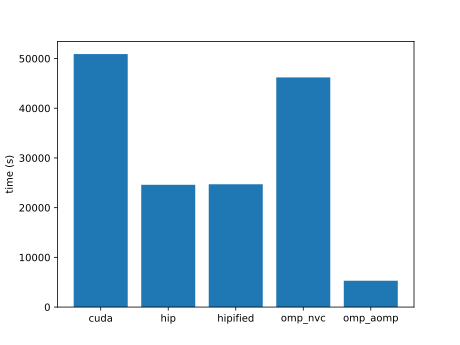
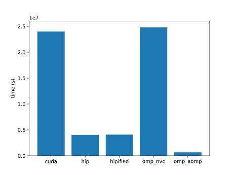
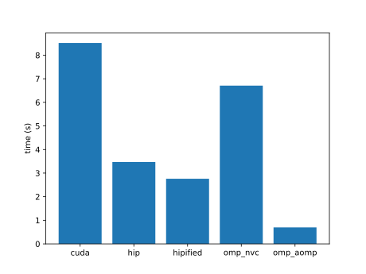
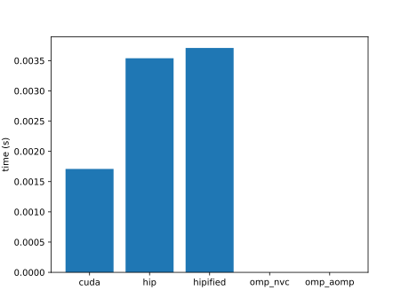
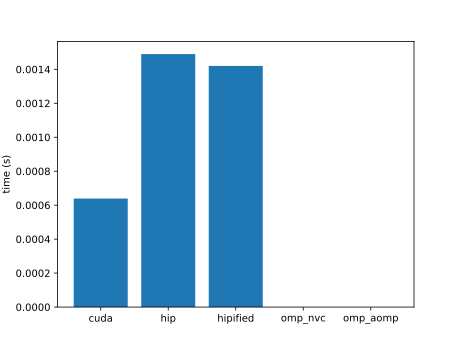
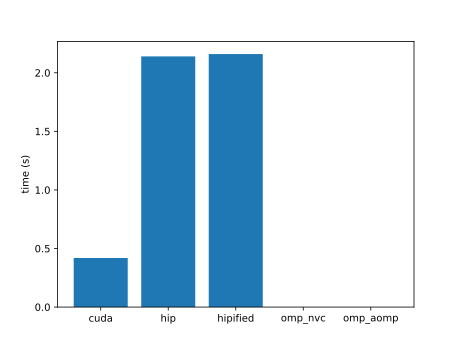

| name | cuda | hip | hipified | omp_nvc | omp_aomp | plot |
|  --  |  --  | --  |   --     |   --    |    --    | -- |
|accuracy|6.14e+02 |1.26e+03 |1.26e+03 |6.41e+03 |4.19e+04 | |
|ace|7.00e+03 |2.67e+03 |2.66e+03 |3.05e+03 | | |
|adam|7.19e-02 |2.31e-01 |2.32e-01 |1.03e-01 | | |
|addBiasResidualLayerNorm| | | | | | |
|adv|3.83e+06 |8.27e+07 |8.47e+07 |6.05e+06 |2.97e+06 | |
|aes|3.40e-04 |3.18e-03 |3.18e-03 |4.39e-04 |3.96e-03 | |
|affine|3.43e-06 |4.30e-06 |4.33e-06 |1.00e-05 | | |
|aidw|7.58e-03 |4.06e-02 |2.31e-01 |9.13e-03 |2.27e-03 | |
|aligned-types|6.38e-01 |1.25e+00 |1.25e+00 |1.70e+00 |2.66e+00 | |
|all-pairs-distance|1.44e+02 |1.82e+03 |1.82e+03 |1.58e+03 |2.82e+02 | |
|allreduce| | | | | | |
|amgmk|2.54e+00 |6.88e-01 |6.87e-01 |2.45e+00 |5.89e-01 | |
|ans|5.27e+00 | | | | | |
|aobench|2.19e-02 |4.03e-03 |4.02e-03 |5.34e-02 |1.10e+00 | |
|aop|4.16e+00 |6.45e+00 | |8.67e+00 | | |
|asmooth|5.19e-03 |1.72e-02 |2.63e-02 |6.48e-03 | | |
|assert|2.37e+00 | | | | | |
|asta|1.53e-02 |2.32e-02 |2.33e-02 |6.82e-02 | | |
|atan2|1.58e+02 |3.61e+02 |3.61e+02 |2.16e+02 | | |
|atomicAggregate|1.23e+00 |1.68e+00 | | | | |
|atomicCAS|1.32e+01 |1.39e+01 |1.44e+01 | | | |
|atomicCost|1.09e+04 |2.46e+04 |2.56e+04 |1.40e+04 |9.25e+05 | |
|atomicIntrinsics| | | | | | |
|atomicPerf|6.63e+03 |4.71e+03 | |6.95e+03 |3.63e+05 | |
|atomicReduction|5.10e+04 |2.46e+04 |2.47e+04 | |5.29e+03 | |
|atomicSystemWide|1.00e+00 |1.00e+01 |1.14e+01 | | | |
|attention|9.26e+00 |6.60e+01 | | | | |
|attentionMultiHead|1.02e+01 |1.23e+01 | | | | |
|axhelm|2.79e+07 | |4.21e+06 |7.85e+07 |2.07e+06 | |
|b+tree|4.22e+03 |9.66e+02 |1.04e+03 |1.46e+03 |9.48e+04 | |
|babelstream|6.68e+06 |2.59e+06 |2.59e+06 |6.01e+06 |8.50e+05 | |
|background-subtract|1.22e+02 |2.62e+02 |2.61e+02 |2.07e+02 | | |
|backprop|2.38e+00 |3.80e-01 |3.80e-01 |2.81e+00 |7.09e-02 | |
|bezier-surface|8.80e+01 |1.75e+02 |1.75e+02 |9.40e+01 | | |
|bfs|2.24e+03 |1.57e+03 |1.60e+03 |1.92e+03 |1.12e+05 | |
|bh|3.75e+00 | | | | | |
|bicgstab|6.17e-01 | | | | | |
|bilateral|4.96e+00 |1.66e+01 |1.66e+01 |5.45e+00 | | |
|bincount|9.10e+03 |5.87e+03 |5.87e+03 | | | |
|binomial|2.75e+03 |1.38e+03 |1.39e+03 | | | |
|bitcracker|1.35e+01 |2.37e+01 |2.36e+01 | | | |
|bitonic-sort|3.30e+01 |8.69e+01 |8.68e+01 |5.49e+01 | | |
|bitpacking|4.09e+00 |2.69e+00 |2.69e+00 | | | |
|bitpermute|2.25e+03 |4.60e+04 | | | | |
|black-scholes|4.71e+03 |5.48e+02 |5.48e+02 |3.25e+03 |-5.01e+01 | |
|blas-dot|2.38e+00 | | | | | |
|blas-fp8gemm|8.42e+00 | | | | | |
|blas-gemm|5.06e+03 |1.13e+04 | | | | |
|blas-gemmBatched|6.69e+04 |2.37e+05 | | | | |
|blas-gemmEx|2.50e+02 |1.28e+00 | | | | |
|blas-gemmEx2|2.49e+02 | | | | | |
|blas-gemmStridedBatched|6.33e+04 |2.34e+05 | | | | |
|blockAccess|2.57e+02 |8.28e+02 |8.26e+02 | | | |
|blockexchange|2.88e+04 | | | | | |
|bm3d| | | | | | |
|bmf|1.54e+00 |6.71e+00 | | | | |
|bn|1.60e-01 | | | | | |
|bonds|4.55e+01 |1.16e+02 |1.16e+02 |8.21e+01 |7.19e+01 | |
|boxfilter|4.39e+02 |8.72e+02 | |7.12e+02 |3.72e+03 | |
|bscan| |1.21e+03 | | | | |
|bsearch|6.76e+00 |4.04e-02 |4.04e-02 | | | |
|bspline-vgh|1.29e-01 |4.19e-01 |4.14e-01 |1.29e-01 |3.36e+00 | |
|bsw|2.49e-02 |3.84e-02 | | | | |
|btree|9.30e-02 | | | | | |
|burger|5.64e-01 |4.07e-01 |4.07e-01 |7.55e-01 | | |
|bwt|3.30e+05 |1.61e+03 |1.66e+03 | |2.83e+03 | |
|car|4.86e-03 |1.54e-02 |1.55e-02 |6.41e-03 | | |
|cbsfil|3.66e-02 |1.83e-02 |1.83e-02 |5.69e-02 | | |
|cc|1.30e-03 |4.00e-03 | | | | |
|ccl| | | | | | |
|ccs|1.13e-02 |5.67e-02 |5.66e-02 |1.37e-02 |1.11e-03 | |
|ccsd-trpdrv|3.65e-01 |1.90e-01 |1.92e-01 |3.10e-01 |2.03e+00 | |
|ced|5.85e-02 |2.96e-01 |2.95e-01 | | | |
|cfd|9.50e-02 |2.07e-01 |2.07e-01 |4.21e-01 |8.90e+00 | |
|chacha20|2.44e+01 |7.82e+01 |7.81e+01 |4.42e+01 |7.19e+01 | |
|channelShuffle|2.40e+01 |4.75e+01 |4.72e+01 |4.92e+01 |5.13e+02 | |
|channelSum|6.28e+01 |1.50e+02 |1.50e+02 |8.69e+01 | | |
|che|7.78e-01 |2.11e+00 |2.12e+00 |9.08e-01 |1.47e+01 | |
|chemv|6.59e+02 |1.47e+03 |1.47e+03 |7.83e+02 | | |
|chi2|1.36e-02 |4.60e-03 |4.60e-03 |1.84e-02 | | |
|clenergy|2.12e-01 |8.66e-01 |8.66e-01 |7.39e-01 |1.73e+01 | |
|clink|3.14e+01 |8.79e+01 |8.74e+01 |3.27e+01 |4.85e+02 | |
|clock|2.61e+06 |3.52e+04 |3.49e+04 | | | |
|cm| | | | | | |
|cmembench|1.05e+00 |4.88e+00 |4.88e+00 | | | |
|cmp| | | | | | |
|cobahh|4.70e+04 | | | | | |
|collision|7.94e+03 | | | | | |
|colorwheel|1.25e+02 | | |1.24e+02 | | |
|columnarSolver| | | | | | |
|complex|9.97e-03 |1.41e-03 |1.41e-03 |1.05e-02 |2.58e-02 | |
|compute-score|6.38e-01 |3.62e+00 |3.62e+00 |1.79e+00 | | |
|concat|2.98e+03 |6.40e+03 |6.40e+03 |4.01e+03 |5.16e+04 | |
|concurrentKernels|2.80e+02 |3.15e+01 |3.15e+01 | | | |
|contract|2.98e+02 |2.94e+00 |2.95e+00 |2.82e+02 |4.81e+00 | |
|conversion|1.74e-01 |4.47e-02 | |7.99e-02 |1.30e-01 | |
|convolution1D|2.76e+05 |4.24e+04 |4.24e+04 |2.48e+06 | | |
|convolution3D|5.51e+01 |1.05e+05 | | | | |
|convolutionDeformable| | | | | | |
|convolutionSeparable|2.30e-03 |1.22e-03 |1.22e-03 |1.15e-02 | | |
|cooling|1.16e+03 |2.20e-01 |4.11e-01 |2.08e+01 | | |
|coordinates|2.51e+07 |2.08e+05 |2.08e+05 | | | |
|copy|1.33e+03 |1.21e+03 | | | | |
|crc64|4.90e+03 |2.26e+03 |2.27e+03 |3.14e+03 |1.47e+03 | |
|cross| |2.73e+03 |2.74e+03 | | | |
|crossEntropy|1.03e+00 |4.00e+00 |4.02e+00 | | | |
|crs|1.54e+02 |7.48e-01 |7.46e-01 | |2.94e-01 | |
|d2q9-bgk|5.85e+00 |1.06e+01 |1.06e+01 |2.46e+01 | | |
|d3q19-bgk| | | | | | |
|damage|1.13e-02 |4.74e-04 |4.74e-04 |2.14e-01 |5.46e-04 | |
|daphne|3.76e-03 |2.81e-02 |2.81e-02 | | | |
|dct8x8|9.45e-03 |5.69e-04 |5.70e-04 | | | |
|ddbp|3.62e-01 |1.08e+00 |1.08e+00 |3.04e-01 | | |
|debayer|1.16e-01 |2.29e-04 |1.49e-03 | |8.12e-03 | |
|degrid|1.31e-02 |5.49e-02 | |3.56e-02 |6.49e-01 | |
|dense-embedding|2.37e+04 |2.99e+04 |2.99e+04 |3.89e+04 | | |
|depixel|1.10e+02 |2.08e+00 |2.09e+00 |1.61e+02 | | |
|deredundancy|1.63e+01 |5.92e+01 |5.92e+01 |1.64e+01 |1.28e+01 | |
|determinant|2.27e+02 | | | | | |
|diamond| | | | | | |
|dispatch|1.04e+01 |1.24e+01 |1.24e+01 | | | |
|distort|2.45e-02 |3.66e-02 |3.66e-02 |2.02e-02 |1.32e+00 | |
|divergence|1.07e+00 |6.01e-01 |6.04e-01 |3.45e-01 |1.72e+02 | |
|doh|2.75e+01 |1.78e+01 |1.77e+01 |2.11e+01 | | |
|dp| | | | | | |
|dpid|2.30e-05 |3.01e-03 | | | | |
|dropout|2.50e+01 |4.75e-01 |4.75e-01 | | | |
|dslash|1.48e+03 |1.32e+02 |4.48e+02 |1.00e+03 |3.25e+01 | |
|dwconv|5.08e+01 |1.02e+02 |1.02e+02 | | | |
|dwconv1d| | | | | | |
|dxtc1|3.69e-04 |1.89e-03 |2.15e-03 | | | |
|dxtc2|3.39e+02 |4.98e+02 | | | | |
|easyWave|4.15e+04 |1.13e+04 |1.13e+04 |4.17e+04 |1.25e+04 | |
|ecdh|1.19e-01 |2.61e-02 |2.62e-02 |1.53e-01 |4.32e-01 | |
|egs|2.91e+03 |1.89e+03 | | | | |
|eigenvalue|2.14e+01 |1.25e+03 |1.25e+03 | |1.60e+03 | |
|eikonal|1.12e+01 |9.13e-01 |9.08e-01 | | | |
|entropy|4.89e-02 |1.74e-02 |1.74e-02 |6.12e-02 | | |
|epistasis|2.01e-02 |4.55e-02 |4.55e-02 |1.28e-01 | | |
|ert|5.29e+00 |3.36e+00 |3.37e+00 | | | |
|expdist|3.32e-03 |3.32e-03 |3.32e-03 |8.97e-03 | | |
|extend2|2.51e+03 |5.30e+03 |5.30e+03 |2.21e+03 | | |
|extrema|2.59e-01 |1.27e+00 |1.27e+00 |0.00e+00 |0.00e+00 | |
|f16max|2.49e+03 |5.63e+03 |5.63e+03 | | | |
|f16sp| | | | | | |
|face|2.89e+00 |9.33e-01 |9.40e-01 | |2.80e-01 | |
|fdtd3d|4.94e-04 |2.55e-04 |2.55e-04 |4.75e-03 |1.91e-03 | |
|feynman-kac|7.98e+00 |1.14e+01 |1.15e+01 |1.98e+00 | | |
|fft|3.70e-04 |3.32e-03 |3.32e-03 |1.18e-03 |1.87e-03 | |
|fhd|7.54e+02 |6.03e-01 |6.03e-01 | | | |
|filter|6.24e+00 |8.01e-01 |7.95e-01 | | | |
|flame|3.70e+05 |1.94e+06 |1.94e+06 | | | |
|flip|5.21e+01 |4.01e+01 |4.01e+01 |9.81e+01 |4.00e+02 | |
|floydwarshall|2.03e-01 |8.97e-03 |8.99e-03 |4.56e-01 |4.78e-02 | |
|floydwarshall2|1.71e-03 |3.56e-03 | | | | |
|fluidSim|1.20e-05 |3.80e-05 |3.80e-05 |2.90e-05 |5.13e-04 | |
|fpc|1.14e-02 |2.58e-03 |2.58e-03 | |1.00e-05 | |
|fpdc| | | | | | |
|frechet|6.44e-03 |6.58e-04 |6.58e-04 | | | |
|fresnel|4.50e-03 |4.47e-03 | | | | |
|frna|7.81e+01 |3.07e+02 | | | | |
|fsm|1.20e-01 |6.56e-01 |6.56e-01 | |1.93e-02 | |
|fwt|6.82e-04 | |1.33e-03 |1.62e-03 | | |
|ga|2.37e+00 |7.65e-01 |7.65e-01 |2.69e+00 |2.18e-01 | |
|gabor|2.15e+04 |2.35e+03 |2.68e+03 | | | |
|gamma-correction|3.63e-03 |3.80e-04 |3.82e-04 |5.55e-03 |4.13e-03 | |
|gaussian|3.20e+06 |8.96e+05 |8.89e+05 |3.35e+06 | | |
|gc|5.90e-05 | | | | | |
|gd|4.12e-01 |1.99e+00 |1.79e+01 | | | |
|ge-spmm|1.53e+03 |6.83e+03 |6.84e+03 | | | |
|geam|5.98e+03 | | | | | |
|gels|1.05e+02 |1.08e+03 | | | | |
|gelu|1.42e+01 |2.20e+01 |2.18e+01 | | | |
|gemv|8.33e+02 |3.32e+03 | | | | |
|geodesic|3.46e-04 |1.08e-03 |1.10e-03 |2.99e-04 |3.09e-02 | |
|gerbil|4.18e+00 |2.74e+00 | | | | |
|gibbs|1.42e+01 |3.38e+01 |3.37e+01 | | | |
|glu|1.86e+04 |2.35e+04 |2.30e+04 |2.49e+04 | | |
|gmm|1.09e+01 |1.85e+00 |8.87e-01 | | | |
|goulash|1.25e+00 |6.80e-01 |6.59e-01 |1.80e+00 |8.40e+00 | |
|gpp|2.27e-01 |2.38e+01 |2.33e+01 |1.72e-01 |2.96e+00 | |
|graphB+|2.85e+00 | | | | | |
|graphExecution|2.62e+05 |5.50e+05 |5.58e+05 | | | |
|grep| | | | | | |
|grrt|1.09e+01 |5.40e+01 |5.04e+01 |8.89e+00 | | |
|gru|2.56e+01 |9.07e+00 |9.47e+00 | | | |
|haccmk|2.11e-03 |3.75e-03 |3.75e-03 |1.97e-03 |4.91e-03 | |
|halo-finder| | | | | | |
|hausdorff|6.45e+00 |1.74e+01 |1.74e+01 |7.21e+00 |3.48e+01 | |
|haversine| | | | | | |
|hbc| | | | | | |
|heartwall| | | | | | |
|heat| | | | | | |
|heat2d| | | | | | |
|hellinger| | | | | | |
|henry| | | | | | |
|hexciton| | | | | | |
|histogram|3.37e+02 |7.10e+02 |7.11e+02 |7.85e+02 |7.89e+03 | |
|hmm|1.41e-01 |4.93e-01 |4.93e-01 |1.85e-01 |1.04e+00 | |
|hogbom| | | | | | |
|hotspot| | | | | | |
|hotspot3D| | | | | | |
|hpl| | | | | | |
|hungarian| | | | | | |
|hwt1d|1.53e-02 |3.12e-02 |3.11e-02 |1.62e-02 |2.96e-02 | |
|hybridsort|2.36e+03 |5.54e+02 |5.57e+02 |3.57e+03 |2.95e+02 | |
|hypterm| | | | | | |
|idivide| | | | | | |
|interleave| | | | | | |
|interval| | | | | | |
|intrinsics-cast| | | | | | |
|intrinsics-simd| | | | | | |
|inversek2j|5.15e-02 |1.69e-01 |1.70e-01 |7.51e+00 |2.40e+01 | |
|is| | | | | | |
|ising|1.23e+00 |3.14e+00 |3.14e+00 |2.13e+00 |9.46e+00 | |
|iso2dfd|2.37e+01 |1.67e+02 |1.68e+02 |3.59e+01 |2.78e+02 | |
|jaccard| | | | | | |
|jacobi|2.63e+00 |8.74e+00 | |3.23e+00 |1.27e+01 | |
|jenkins-hash|3.06e-03 |1.13e-02 |1.14e-02 |2.70e+00 |1.18e+00 | |
|kalman| | | | | | |
|keccaktreehash| | | | | | |
|keogh| | | | | | |
|kernelLaunch| | | | | | |
|kmc| | | | | | |
|kmeans| | | | | | |
|knn| | | | | | |
|kurtosis| | | | | | |
|lanczos| | | | | | |
|langevin| | | | | | |
|langford| | | | | | |
|laplace|1.12e+00 |3.55e+00 |3.55e+00 |4.67e+00 |2.07e+01 | |
|laplace3d| | | | | | |
|lavaMD| | | | | | |
|layernorm| | | | | | |
|layout|1.33e+02 |1.94e+02 |1.94e+02 |8.79e+01 |4.46e+02 | |
|lci| | | | | | |
|lda| | | | | | |
|ldpc| | | | | | |
|lebesgue| | | | | | |
|leukocyte| | | | | | |
|lfib4| | | | | | |
|libor|2.95e-03 |8.72e-03 |8.73e-03 |3.31e-03 |1.33e-02 | |
|lid-driven-cavity| | | | | | |
|lif|1.37e+04 |3.15e+04 |4.18e+04 |1.11e+04 |5.73e+04 | |
|linearprobing|1.77e-03 |8.69e-04 |8.65e-04 | | | |
|log2| | | | | | |
|logan| | | | | | |
|logic-resim| | | | | | |
|logic-rewrite| | | | | | |
|logprob|6.49e+03 |1.36e+04 | | | | |
|lombscargle|2.90e+02 |5.03e+02 |5.02e+02 |2.13e+02 |7.19e+02 | |
|loopback| | | | | | |
|lr| | | | | | |
|lrn| | | | | | |
|lsqt| | | | | | |
|lud| | | | | | |
|ludb| | | | | | |
|lulesh| | | | | | |
|lzss| | | | | | |
|mallocFree| | | | | | |
|mandelbrot|5.67e-02 |1.67e-01 |1.67e-01 |6.30e-02 |2.98e-01 | |
|marchingCubes| | | | | | |
|mask|5.72e+06 |1.36e+03 |1.44e+03 |6.21e+04 |1.90e+05 | |
|match| | | | | | |
|matern| | | | | | |
|matrix-rotate|7.05e-02 |7.92e-01 |8.08e-01 |6.83e-02 |7.84e-01 | |
|matrixT| | | | | | |
|maxFlops| | | | | | |
|maxpool3d|3.63e-03 |1.57e-02 |1.55e-02 |7.35e-03 |2.92e-02 | |
|mcmd| | | | | | |
|mcpr| | | | | | |
|md|6.68e-05 |2.47e-04 |2.47e-04 |7.21e-05 |2.73e-04 | |
|md5hash| | | | | | |
|mdh| | | | | | |
|meanshift|4.57e-01 |1.43e+00 |1.51e+00 |1.09e+00 |1.26e+00 | |
|medianfilter|7.60e-05 |1.61e-04 |1.60e-04 |2.42e-04 |3.60e-04 | |
|memcpy| | | | | | |
|memtest| | | | | | |
|merge|2.24e+05 |5.50e+05 |5.50e+05 |5.40e+05 |8.03e+05 | |
|merkle|2.32e+03 |2.37e+03 | | | | |
|metropolis|1.44e+03 |5.76e+01 | | | | |
|mf-sgd| | | | | | |
|michalewicz|1.09e+05 |4.42e+04 |4.53e+04 | | | |
|miniDGS| | | | | | |
|miniFE| | | | | | |
|miniWeather| | | | | | |
|minibude|7.66e+02 |2.02e+03 |2.02e+03 |1.24e+03 | | |
|minimap2|2.33e-02 | |1.13e-02 | | | |
|minimod|7.30e-01 |1.06e+00 |1.06e+00 | | | |
|minisweep|6.21e+02 |9.05e+01 |9.17e+01 | |2.39e+00 | |
|minkowski|2.43e-03 |1.47e-02 |7.74e-02 |2.20e-03 |6.70e-01 | |
|minmax|4.86e+04 |3.44e+03 | | | | |
|mis|9.20e-05 |2.26e-04 |2.25e-04 | | | |
|mixbench|2.52e+00 | |2.52e+01 |2.78e+00 | | |
|mmcsf|2.42e+00 |2.81e+00 |2.80e+00 | | | |
|mnist|1.58e+01 |7.59e+01 |7.45e+01 | | | |
|morphology|2.24e-01 |2.62e-02 |2.62e-02 | |4.24e-03 | |
|mpc|8.91e+01 | |1.19e+01 | | | |
|mr|6.97e+01 |2.88e+00 |2.90e+00 | |6.46e+02 | |
|mrc|2.29e+04 |3.87e+02 |3.87e+02 | | | |
|mrg32k3a|1.75e+07 |3.63e+04 | | | | |
|mriQ|2.62e+00 |6.37e+00 |2.76e+01 | | | |
|mt|2.99e-03 |3.67e-03 |3.67e-03 |1.68e-03 | | |
|mtf|7.91e-02 |1.94e-01 |1.94e-01 | | | |
|multimaterial|1.08e+02 |1.60e+01 |1.63e+01 |4.38e+00 | | |
|multinomial|1.90e+03 |1.87e+03 |1.87e+03 | | | |
|murmurhash3|4.65e-03 |2.04e-03 |2.04e-03 | |7.53e-03 | |
|myocyte|1.76e+02 |3.56e-01 |3.51e-01 | | | |
|nbnxm|1.11e+01 |4.00e+02 | | | | |
|nbody|4.26e+01 |5.01e-02 |5.03e-02 |5.86e+01 |5.40e-01 | |
|ne|1.06e-03 |2.47e-03 |2.47e-03 |1.60e-03 | | |
|nlll|6.92e+02 |9.20e+01 |9.16e+01 | | | |
|nms|9.30e-05 |1.68e-04 |1.67e-04 | | | |
|nn|3.89e+00 |2.66e+00 |2.65e+00 |8.25e+00 |5.67e+01 | |
|nonzero|7.30e+03 |2.10e+03 |2.12e+03 | | | |
|norm2|2.06e+03 | | |1.59e+04 | | |
|nosync|5.34e+04 |4.99e+04 | | | | |
|nqueen|3.85e-02 |3.67e-01 |3.67e-01 |4.40e-02 |2.84e-01 | |
|ntt|3.98e+01 |7.31e+01 |7.31e+01 |4.17e+01 |9.96e+01 | |
|nw|4.92e-02 |4.37e-02 |4.37e-02 |1.18e-01 |8.95e-01 | |
|openmp|2.55e+00 |8.37e-01 |8.43e-01 |2.54e+00 |1.14e+01 | |
|opticalFlow|3.90e+03 |2.96e+03 |2.48e+03 | | | |
|overlap|1.10e-01 |1.75e+00 | | | | |
|overlay| | | | | | |
|p2p| | | | | | |
|p4|8.50e+01 |9.46e+01 |1.23e+02 |6.23e+04 |3.07e+02 | |
|pad|2.82e+05 |1.50e+03 | | | | |
|page-rank|4.11e-01 |2.96e+00 |3.09e+00 |4.14e-01 | | |
|particle-diffusion|2.48e-03 |1.38e-02 |1.37e-02 |2.27e-03 |9.51e-02 | |
|particlefilter|2.79e+00 |2.33e+00 |2.32e+00 | |4.80e+00 | |
|particles|1.24e+00 |1.54e+00 |1.54e+00 | | | |
|pathfinder|2.19e+01 |6.30e-01 |6.30e-01 | | | |
|pcc|1.74e+00 | | | | | |
|perlin|2.24e+02 |5.74e+02 |5.70e+02 | | | |
|permutate|2.24e+00 |7.31e+00 |7.52e+00 | |8.71e+00 | |
|permute|1.01e+01 |7.89e-01 | |1.15e+01 |1.02e+01 | |
|perplexity|1.50e+00 |1.74e-02 |1.74e-02 |1.37e+00 | | |
|phmm|1.26e+03 |9.33e+04 |9.33e+04 |5.19e+03 |1.91e+04 | |
|pingpong| | | | | | |
|pitch|6.58e+02 |1.84e+03 |1.84e+03 | | | |
|pnpoly|4.75e-02 |1.66e-01 |1.66e-01 |7.17e-01 | | |
|pns|5.19e+00 |7.41e+00 |7.41e+00 | |7.00e-02 | |
|pointwise|9.17e-02 |9.31e-03 |9.15e-03 |1.30e+00 | | |
|pool|9.24e-03 |1.27e-02 |1.27e-02 |1.57e-02 |1.19e-01 | |
|popcount|7.69e+05 |1.31e+03 |1.31e+03 |1.11e+05 |1.02e+04 | |
|prefetch|1.36e+01 |5.65e+02 |2.14e+03 | | | |
|present|3.83e+01 |2.53e+02 |2.52e+02 |9.38e+01 |2.76e+03 | |
|prna| | | | | | |
|projectile|1.35e-04 |3.07e-04 |3.07e-04 |1.20e-04 |3.82e-03 | |
|pso|3.40e+01 |7.43e+01 |7.43e+01 |3.04e+01 |1.53e+02 | |
|qem|5.31e+01 |1.10e+02 | | | | |
|qkv|1.73e+01 |4.99e+01 | | | | |
|qrg|4.55e+01 |1.94e+02 |1.94e+02 |7.56e+01 | | |
|qtclustering|3.31e+01 |4.42e-01 |4.43e-01 | | | |
|quicksort|6.77e+03 |3.20e+03 |3.22e+03 | | | |
|radixsort|5.51e-04 |1.18e-03 |1.18e-03 |5.71e-03 | | |
|radixsort2|4.74e-01 |2.13e-01 |2.13e-01 | | | |
|rainflow|1.72e+05 |5.61e+04 |5.61e+04 |1.27e+05 |2.53e+04 | |
|randomAccess|1.54e-01 |1.20e+00 |1.19e+00 |1.93e+00 |5.86e-01 | |
|rayleighBenardConvection|2.97e+01 |4.60e+01 | | | | |
|reaction|1.72e+00 |5.14e+00 |5.14e+00 |6.74e+00 |2.21e+01 | |
|recursiveGaussian|1.45e-03 |2.65e-03 | | |7.42e-03 | |
|relu|9.92e+03 |1.70e+02 | | | | |
|remap|4.08e+04 |2.18e+04 |2.16e+04 | | | |
|resize|3.20e+03 |2.65e+03 |2.65e+03 | | | |
|resnet-kernels|1.67e+03 |4.67e+03 | | | | |
|reverse|1.00e+00 |1.27e+00 |1.27e+00 |5.54e+00 | | |
|reverse2D|5.36e+01 |6.15e+00 |6.19e+00 | | | |
|rfs|1.61e-03 |2.73e-04 |2.74e-04 | | | |
|ring|3.44e+01 |4.89e+04 |4.87e+04 | | | |
|rle|6.20e+01 |1.91e-01 | | | | |
|rng-wallace|1.38e-04 |3.13e-04 |3.13e-04 |1.13e-03 | | |
|rodrigues|3.10e+04 |4.84e+01 |4.84e+01 |2.01e+04 |5.24e+02 | |
|romberg|3.52e-04 |9.22e-04 |9.19e-04 |3.34e-04 | | |
|rotary|4.98e+01 |2.24e+02 | | | | |
|rowwiseMoments| | | | | | |
|rsbench|2.93e+00 |3.67e+00 |3.66e+00 | |2.54e+00 | |
|rsc|1.68e+02 |3.27e+02 |3.29e+02 | | | |
|rsmt|6.69e-02 | | | | | |
|rtm8|1.14e-03 |4.36e-03 |4.36e-03 |8.94e-04 |2.69e-02 | |
|rushlarsen|1.61e+00 |2.60e-02 |2.59e-02 |1.27e+00 |5.20e-01 | |
|s3d|4.77e+00 |5.74e-01 |5.57e-01 |7.41e+00 |3.26e+00 | |
|s8n|1.42e+06 |4.43e+04 |4.43e+04 |3.14e+06 |3.15e+05 | |
|sa|1.27e+00 |1.60e-02 |1.61e-02 | | | |
|sad|4.62e+02 |1.64e+03 | | | | |
|sampling|7.22e+02 |8.28e+02 |8.22e+02 |5.68e+02 |1.25e+04 | |
|saxpy-ompt| | | | | | |
|sc|2.98e+02 |5.49e+02 | | | | |
|scan|7.10e+05 |1.06e+05 |1.06e+05 |4.80e+06 |1.30e+05 | |
|scan2|7.00e+02 |6.09e+02 |6.09e+02 |6.77e+04 |3.63e+03 | |
|scan3|4.41e+02 |4.65e+02 |4.62e+02 | | | |
|scel|3.77e+03 |1.92e+03 |2.01e+03 |7.59e+03 | | |
|score|3.10e+00 |6.28e+00 | | | | |
|sddmm-batch|5.46e+03 |2.17e+02 | | | | |
|seam-carving|2.39e+01 |3.71e+01 |3.75e+01 | | | |
|secp256k1|2.95e-03 |8.42e-03 |8.42e-03 |2.90e-03 |3.45e-04 | |
|segment-reduce|2.49e+03 |1.61e+03 |1.59e+03 | | | |
|segsort|1.98e-03 |4.81e-03 | | | | |
|sheath|3.15e+00 |4.40e+00 |4.85e+02 |3.36e+00 | | |
|shmembench|2.76e+00 |5.49e+00 |5.49e+00 | |9.44e-01 | |
|shuffle|1.77e+04 |3.61e+04 | | | | |
|si| | | | | | |
|simpleMultiDevice|8.91e+02 |5.28e+03 |5.34e+03 | | | |
|simpleSpmv|3.08e+02 |5.88e+01 | |3.08e+02 |3.82e+01 | |
|simplemoc|1.72e+02 |3.73e+00 |3.71e+00 |1.18e+03 |1.25e+05 | |
|slit|2.98e-02 | | | | | |
|slu| | | | | | |
|snake|4.43e+03 |1.15e+04 |1.15e+04 |7.19e+03 |2.64e+04 | |
|sobel|5.53e+00 |8.56e+00 |9.19e+00 |1.20e+01 |2.45e+02 | |
|sobol|1.34e-03 |4.29e-03 |4.29e-03 |4.21e-03 |1.17e-02 | |
|softmax|1.10e+01 |4.43e+01 | | | | |
|softmax-fused|3.50e-01 |6.82e+00 | | | | |
|softmax-online|2.38e+01 |3.38e+01 | | | | |
|sort|2.83e-02 |4.95e-02 |4.95e-02 | | | |
|sortKV|3.22e+03 |1.96e+04 |1.95e+04 | | | |
|sosfil|2.07e-02 |6.17e-02 |6.17e-02 |1.05e-01 | | |
|sparkler| | | | | | |
|spaxpby|1.84e+01 | | | | | |
|spd2s|2.49e+04 |1.39e+04 | | | | |
|spgeam|9.16e+01 | | | | | |
|spgemm|7.65e+03 |3.36e+03 | | | | |
|sph|6.11e+00 |5.25e+00 |5.25e+00 |5.91e+00 | | |
|split|1.37e+04 |4.92e+02 |4.92e+02 |1.60e+05 | | |
|spm|7.69e+01 |1.03e+00 |1.03e+00 |7.49e+01 | | |
|spmm|2.38e+02 |1.23e+02 | | | | |
|spmv|3.43e-01 |1.91e+00 | | | | |
|spnnz|5.56e+03 | | | | | |
|sps2d|9.38e+03 |1.49e+04 | | | | |
|spsm|1.52e+04 |2.37e+02 | | | | |
|spsort|6.55e+05 |5.50e+03 | | | | |
|sptrsv|1.19e+02 |1.49e+02 |1.47e+02 |1.11e+02 | | |
|srad| | | | | | |
|ss|2.40e+02 |2.93e+02 |2.93e+02 |7.91e+02 |4.61e+04 | |
|ssim|1.84e+00 |6.24e+00 | | | | |
|sss| | | | | | |
|sssp|2.59e+03 |3.57e+02 |3.59e+02 | | | |
|stddev|3.75e-03 |5.36e-02 |1.47e-01 |6.50e-02 | | |
|stencil1d|2.25e-03 |1.09e-03 |1.09e-03 | | | |
|stencil3d|1.63e-02 |3.39e-02 |3.37e-02 | |1.57e-03 | |
|streamCreateCopyDestroy|7.79e+01 |8.34e+02 |8.38e+02 | | | |
|streamOrderedAllocation|6.83e+05 |8.74e+06 |8.75e+06 | | | |
|streamPriority|1.37e+01 |1.55e+01 |1.55e+01 | | | |
|streamUM|7.79e+00 |1.55e+00 | | | | |
|streamcluster|1.93e+01 |3.98e+00 |3.97e+00 | | | |
|stsg| | | | | | |
|su3|3.85e+00 |1.52e+00 |1.52e+00 |4.72e+00 | | |
|surfel|2.12e+04 |9.96e+01 |9.96e+01 |2.41e+04 |1.79e+03 | |
|svd3x3|7.23e+01 |1.48e+02 |2.23e+02 |7.14e+01 |8.52e+03 | |
|sw4ck|1.20e+01 |9.53e+01 |9.53e+01 | |1.81e+03 | |
|swish|2.15e+02 |2.06e+02 |2.06e+02 |1.90e+04 | | |
|tensorAccessor|1.11e+05 |8.28e+03 |8.28e+03 | | | |
|tensorT|1.67e+00 |7.45e+00 |7.45e+00 |4.46e+00 |6.92e+01 | |
|testSNAP|1.26e+01 |4.57e+01 |4.61e+01 |1.55e+01 |3.50e+00 | |
|thomas|1.46e+04 |1.60e+02 |1.59e+02 |1.27e+04 |2.28e+02 | |
|threadfence|2.29e+02 |8.43e-01 |8.45e-01 |3.25e+02 | | |
|tissue|7.68e-03 |9.87e-02 |9.86e-02 |8.15e-03 | | |
|tonemapping|1.71e+01 |9.67e+01 |9.67e+01 |1.83e+01 |3.50e+02 | |
|tpacf|8.34e+00 |1.54e+01 | | | | |
|tqs|1.33e+02 |1.46e+03 |1.48e+03 | | | |
|triad|1.77e+03 |2.30e+02 |2.30e+02 |5.89e+02 | | |
|tridiagonal|3.23e-01 |2.11e-01 |2.09e-01 |1.32e+00 | | |
|tsa| | | | | | |
|tsne| | | | | | |
|tsp|2.52e-02 |1.03e-01 |1.38e-01 | | | |
|unfold|8.70e+03 |1.02e+02 | | | | |
|urng|1.95e+01 |9.27e+00 |9.30e+00 |2.20e+01 |6.34e+02 | |
|vanGenuchten|7.29e-03 |2.22e-03 |2.22e-03 |7.56e-03 | | |
|vmc|2.59e-03 |1.18e-02 |1.18e-02 | | | |
|vol2col|2.64e+03 |6.97e+03 |6.97e+03 |2.74e+03 | | |
|vote|7.46e-01 |5.88e+00 | | | | |
|voxelization|7.89e+01 |9.36e+02 |9.36e+02 | | | |
|warpexchange|2.27e+06 |1.05e+03 | | | | |
|warpsort|6.24e+02 |2.08e+02 | | | | |
|wedford|2.11e+00 |1.12e+01 | | | | |
|winograd|3.03e+00 |9.01e-01 |9.01e-01 |3.11e+00 |3.35e+00 | |
|wlcpow|2.12e+03 |6.38e+03 |6.38e+03 |6.68e+03 | | |
|wmma| | | | | | |
|word2vec|8.51e+07 |1.13e+08 |1.16e+08 | | | |
|wordcount|6.16e-03 |8.00e-02 |8.01e-02 |9.93e-03 |3.52e-02 | |
|wsm5|3.25e+02 |9.29e+02 |9.30e+02 |3.29e+02 | | |
|wyllie|1.86e+02 |6.96e+00 |7.00e+00 | |4.06e-01 | |
|xlqc| | | | | | |
|xsbench|4.48e+01 |5.28e+01 |4.14e+01 |3.76e+00 |2.55e+01 | |
|zerocopy|8.88e+00 |4.42e+02 |3.19e+02 | | | |
|zeropoint|2.94e+04 |1.77e+02 |1.77e+02 |1.04e+04 | | |
|zmddft|1.91e+00 |6.30e+00 |6.30e+00 |2.03e+00 |3.13e+00 | |
|zoom|5.24e+03 |2.43e+03 |2.43e+03 | | | |
